<div align="center">

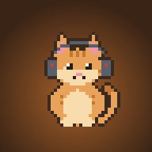

# 心流小屋 · Flow Cabin

**听一张喜欢的唱片，安心做完这一轮。**<br>
<sub>A cozy pixel-art desktop cabin for your favourite albums, focus sessions and a tiny companion.</sub>

<p>
<a href="https://github.com/ooooooomygosh/album-web/releases/latest"></a>
<a href="https://github.com/ooooooomygosh/album-web/releases"></a>
<a href="https://github.com/ooooooomygosh/album-web/actions/workflows/ci.yml"></a>

<a href="https://github.com/ooooooomygosh/album-web/stargazers"></a>
</p>
<p>


</p>

[**⬇ 下载最新版**](https://github.com/ooooooomygosh/album-web/releases/latest) · [第一次使用](docs/getting-started.md) · [功能一览](#-功能一览) · [截图](#-截图) · [快速开始](#-快速开始) · [English](#english)

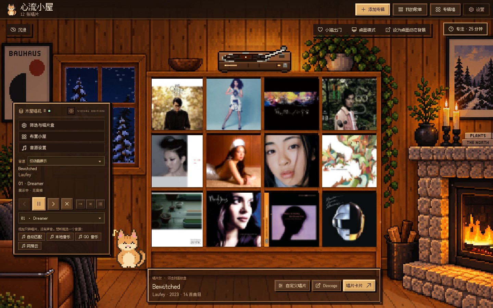

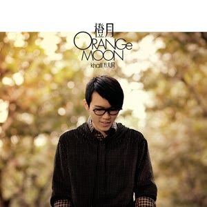


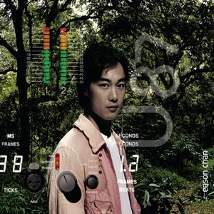


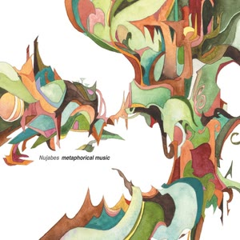
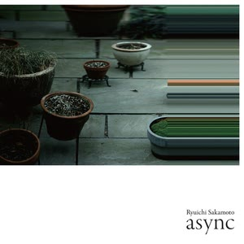

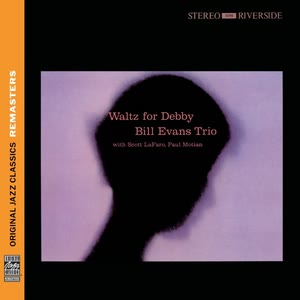


<sub>真实运行界面与真实专辑封面（来自 iTunes Search API，版权归各自权利人）。展示使用隔离收藏，不含平台账号与音频。· <a href="docs/showcase-sources.md">专辑与图片来源</a></sub>

</div>

---

## ✨ 功能一览

<table>
<tr>
<td width="33%" valign="top">

### 💿 唱片架与唱机
十二格唱片架顶上摆着一台像素唱机：双击封面或拖上去，唱片落座、唱臂摆入、指示灯亮起，播放时音符随节奏飘出。唱片卡片里看曲目、写笔记，给黑胶挑颜色，用唱片盒整理收藏，还能导出一张专辑墙。

</td>
<td width="33%" valign="top">

### 🍅 番茄钟与待办
像素进度环 + 一键节奏（冲刺 15/5 · 经典 25/5 · 深度 50/10 · 心流 90/20），长短休自动切换，系统通知与提示音。待办可拖动排序、双击改名，并绑定到当前专注。

</td>
<td width="33%" valign="top">

### 📊 统计与奖励
今日 / 连续天数 / 累计专注，最近 7 天柱状图。每完成一轮得 1 条小鱼干，升级解锁小猫配饰与窗外天气。随手记把突然冒出的念头先存下来。

</td>
</tr>
<tr>
<td valign="top">

### 🎧 连接你的音乐
本地音乐、QQ 音乐 / 网易云、系统正在播放、Music Assistant。唱机默认只做动画展示；选「自动匹配可播放音源」后，按歌名、歌手和版本找能播的那一首（先 QQ 再网易云），不会拿现场版或翻唱顶替。

</td>
<td valign="top">

### 🌧 程序合成的氛围
雨声、壁炉、风声、白噪声与黑胶底噪由程序实时合成；Lo-fi 电台用 Tone.js 离线生成，每 16 小节换一段，唱机播放时自动让路。屋里有飘浮的灰尘与随时间变化的窗光，雪、炉火也会动。

</td>
<td valign="top">

### 🐱 伙伴、桌宠与动态桌面
六个统一像素风的场景（像素小屋 / 琥珀小屋 / 月夜书桌 / 林间书屋 / 海边慢屋 / 星夜阁楼），默认是像素小屋；再配五位像素伙伴。伙伴会呼吸、被戳会冒爱心、跟着音乐摇摆，还可以出门成为桌宠。所有动效都支持「减少动态效果」。

</td>
</tr>
<tr>
<td valign="top">

### 🌙 月夜书桌
月夜窗边戴耳机写字的女孩，右侧是九格木质唱片架。她会写一阵、抬笔、用拇指转一圈笔再接住落笔；封面随台灯方向明暗变化，鼠标停留时被照亮。窗口隐藏时动画暂停。

</td>
<td valign="top">

### 🖥 动态桌面与全屏
「沉入桌面」一键把窗口收起，小屋变成桌面背景（在图标后面），伙伴还能点、能拖，左下角的像素迷你唱机悬停出按钮；双击迷你唱机、托盘「浮出桌面」或 <kbd>Ctrl/⌘</kbd>+<kbd>Alt</kbd>+<kbd>D</kbd> 回到窗口。桌面版按全屏按钮或 <kbd>F11</kbd> 进入干净全屏：隐藏顶栏、工具栏、唱机和弹窗，只留场景；<kbd>Esc</kbd> / <kbd>F11</kbd> 返回。

</td>
<td valign="top">

### 🔒 数据留在本机
收藏、笔记、专注记录、待办和随手记保存在本机，可在「设置 › 数据与备份」中导出 / 导入。平台凭据通过 Electron safeStorage 加密保存，不能安全加密时拒绝保存。

</td>
</tr>
<tr>
<td valign="top">

### 🎶 我的歌单
标题栏「我的歌单」：登录网易云 / QQ 音乐后读取「我喜欢」、自建和收藏的歌单；Apple Music 可读 macOS「音乐」App 歌单、公开歌单链接或导出的 .xml / .m3u 文件。歌单像唱片一样放上唱机，每首先试原平台曲目，再做同版本匹配；下一首提前匹配，切歌几乎无等待，放不了的歌自动跳过。

</td>
<td valign="top">

### 💿 唱机特写
按 <kbd>T</kbd> 或唱机面板上的眼睛按钮：一台像素唱机放在台灯下，盘面有惯性起停，唱臂抬起、摆入、落针并随进度向内移动；黑胶上能看到曲目间隔圈，拖动唱臂即可换位置，33 / 45 转可切换。双击封面时唱片会从唱片架飞上唱机。

</td>
<td valign="top">

### 🖥 桌面模式与学习
桌面层挂不上时（比如装了别的动态壁纸），「沉入桌面」会改用贴在桌面上的可操作窗口，时钟、正在播放、专注和待办变成可拖动的桌面小组件。托盘 / 菜单栏图标会跟着你选的伙伴变。「学习」页有 FSRS 闪卡复习、考试倒计时、每日目标和专注热力图；桌宠可以抛起、落地，空闲时沿屏幕底边散步。

</td>
</tr>
</table>

## 📸 截图

<div align="center">

<sub>真实界面录屏（无音轨）：三步入门 → 开始专注 → 布置小屋 → 沉浸模式。<a href="docs/assets/cabin-tour.mp4">高清 MP4</a></sub>
</div>

<table>
<tr>
<td width="33%" align="center">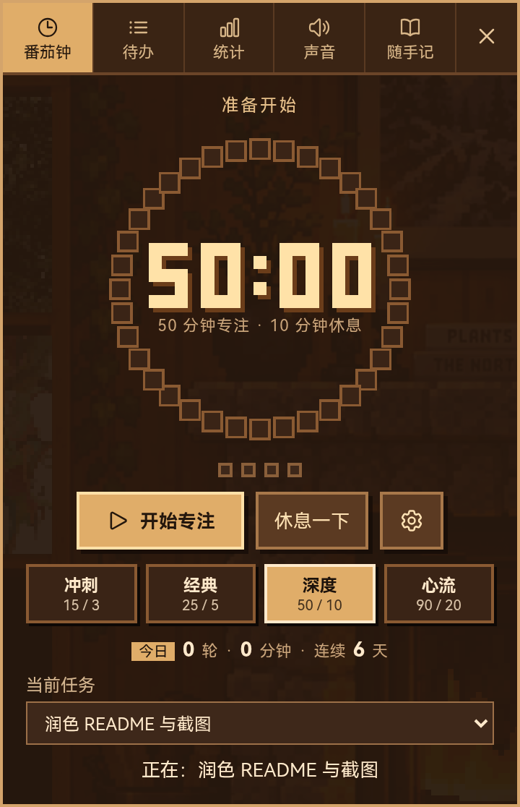<br><sub><b>番茄钟</b> · 像素进度环与节奏预设</sub></td>
<td width="33%" align="center">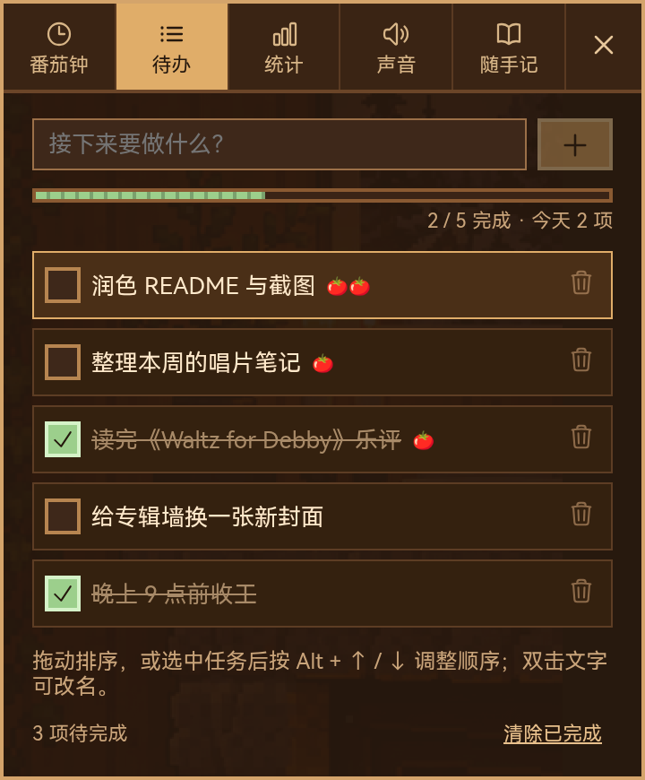<br><sub><b>待办</b> · 进度条、🍅 计数、拖动排序</sub></td>
<td width="33%" align="center">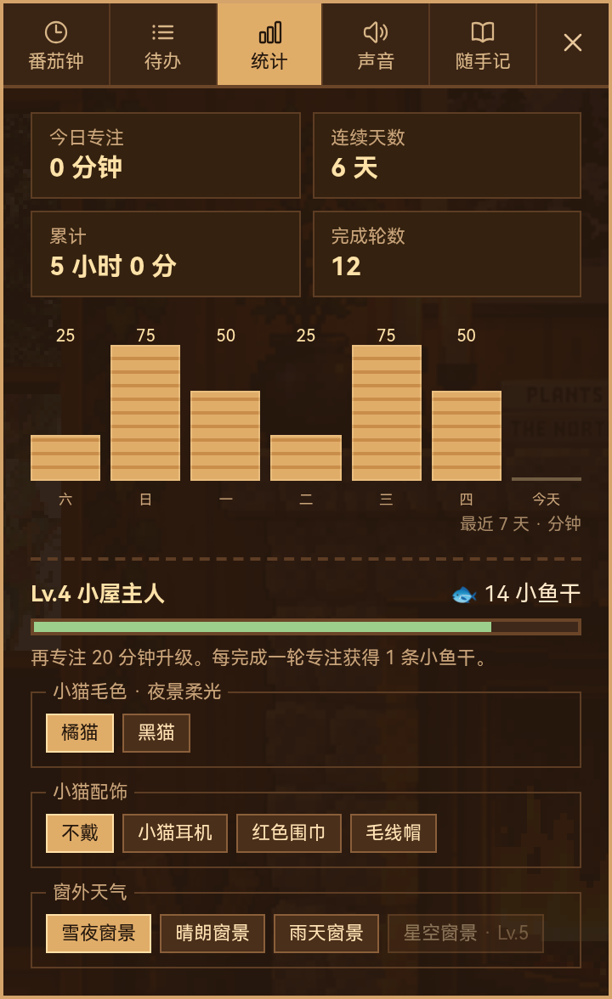<br><sub><b>统计</b> · 7 天柱状图与小屋奖励</sub></td>
</tr>
</table>

| 专注中的小屋 | 设置 › 房间与桌宠 | 新手引导 |
| :---: | :---: | :---: |
| 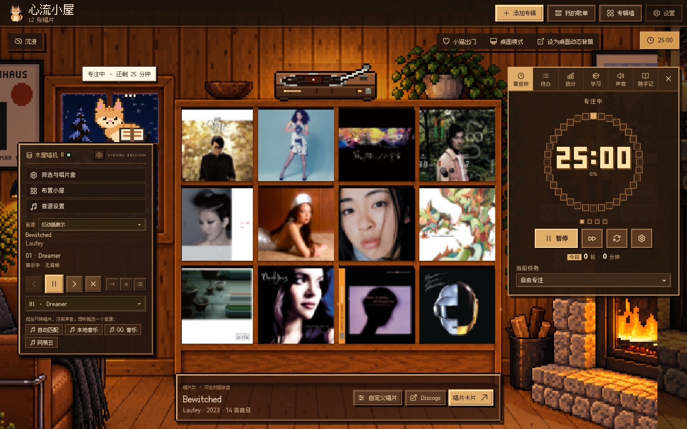 | 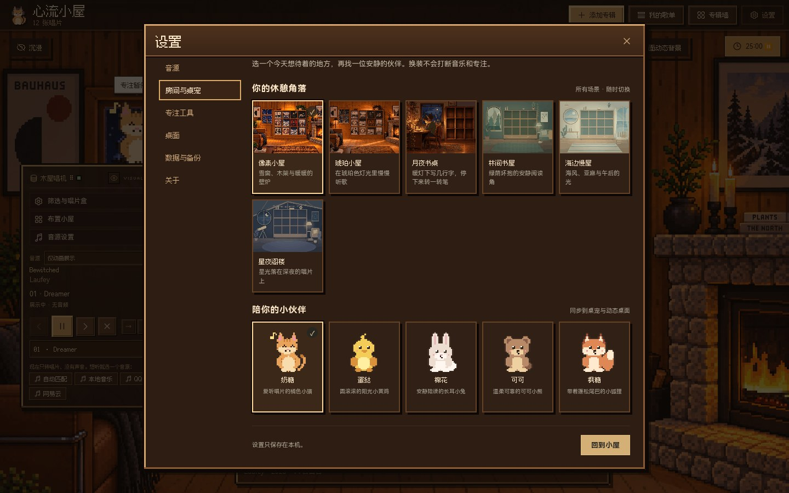 | 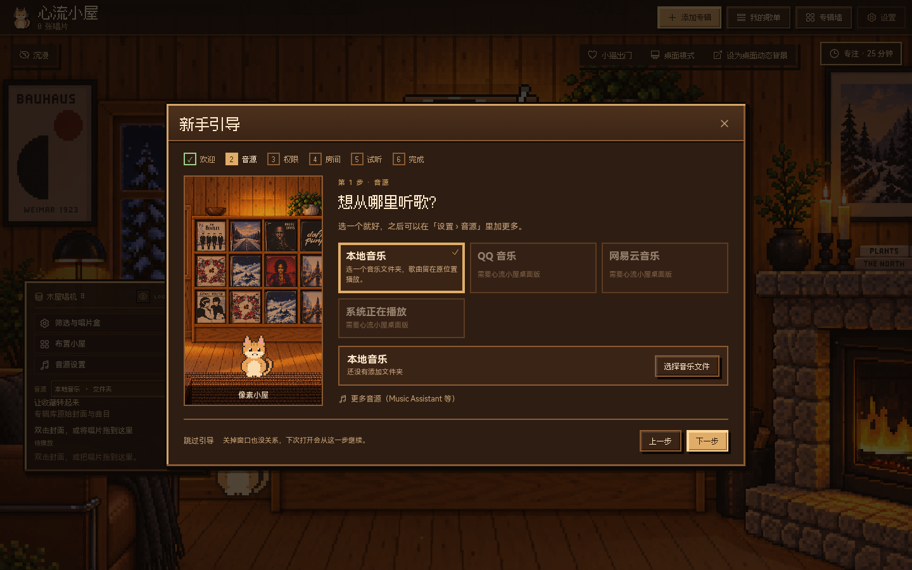 |

<sub>截图展示当前开发分支的界面，可能尚未打包进最新 Release。重现方法见 <a href="#-截图是怎么来的">截图是怎么来的</a>。</sub>

## ⬇ 下载

| 你的电脑 | 下载 | 怎么打开 |
| --- | --- | --- |
| Mac · Apple Silicon（M 系列） | [DMG · arm64](https://github.com/ooooooomygosh/album-web/releases/download/v1.10.0/FlowCabin-1.10.0-mac-arm64.dmg) | 打开 DMG，把小屋拖进「应用程序」 |
| Mac · Intel | [DMG · x64](https://github.com/ooooooomygosh/album-web/releases/download/v1.10.0/FlowCabin-1.10.0-mac-x64.dmg) | 打开 DMG，把小屋拖进「应用程序」 |
| Windows · x64 | [安装版](https://github.com/ooooooomygosh/album-web/releases/download/v1.10.0/FlowCabin-1.10.0-x64-setup.exe) · [便携版](https://github.com/ooooooomygosh/album-web/releases/download/v1.10.0/FlowCabin-1.10.0-x64-portable.exe) | 安装版按提示安装；便携版直接运行 |

以上文件对应 **v1.10.0**，新版本请到 [Release 页面](https://github.com/ooooooomygosh/album-web/releases/latest)。macOS 尚未完成开发者签名与公证，Windows 可能提示未知发布者，请先核对下载来源，再看[安装说明](docs/getting-started.md#安装与首次打开)。使用小屋不需要注册账号。

## 🎧 音源支持

| 音源 | 现在可以做什么 | 需要知道 |
| --- | --- | --- |
| 本地音乐 | 选择文件夹，按标签整理专辑，播放原位置的文件 | 文件保留在原目录，无需平台账号 |
| 自动匹配 | 按歌名、歌手、版本匹配；先用唱片自带的原始曲目 ID，再依次试 QQ、网易云，跳过放不了的候选 | 不会自动换成别的歌手、现场版或翻唱；匹配不到时可手动选 |
| QQ 音乐 / 网易云 | 独立登录窗口、曲目检索与播放接入；两者之间可互为后备 | 受账号、会员、版权与地区限制；登录后可在「我的歌单」导入自己的歌单（真实账号尚未验收） |
| 系统正在播放 | 显示歌曲，发送暂停 / 继续 / 切歌 | Windows 用系统媒体接口；macOS 目前连接 Music / Spotify，可能需自动化权限 |
| Music Assistant | 连接已有服务器与播放器 | 需要自己的服务器；未完成真实音箱验收 |

搜索到专辑不等于获得播放权限。各平台验收范围见[使用边界](docs/limitations.md#音乐与平台)，连接方法见[如何连接音源](docs/getting-started.md#连接音乐)。

## 🧭 第一次使用

第一次打开会出现 **新手引导**：选音源并登录 / 添加文件夹 → 打开需要的权限（通知；Mac 上的「音乐」自动化；可选开机启动）→ 选房间和伙伴 → 播放测试音确认有声音。每一步都能跳过；中途关掉，下次从那一步继续。

所有设置都在右上角 **「设置」**：音源 · 房间与桌宠 · 专注工具 · 桌面（沉入桌面，<kbd>Ctrl/⌘</kbd>+<kbd>Alt</kbd>+<kbd>D</kbd> 退出）· 数据与备份 · 关于（**重新引导**）。原来的「布置小屋」「音源设置」按钮仍可用，会直接打开对应分区。说明见 [docs/onboarding.md](docs/onboarding.md)。

## 🚀 快速开始

需要 **Node.js 24.x**。

```bash
git clone https://github.com/ooooooomygosh/album-web.git
cd album-web
npm ci
npm --prefix desktop ci

npm run dev               # 只启动 React 渲染层（Vite，http://127.0.0.1:5173）
npm run desktop:dev       # 构建并启动完整 Electron 客户端
```

| 命令 | 作用 |
| --- | --- |
| `npm test` | 桌面端 Node 测试 + 音频生命周期 + 专注模型单测 |
| `npm run check` | `npm test` + 前端生产构建（CI 同款） |
| `npm run test:browser` | 隔离浏览器冒烟回归（需要 Chromium：`cd desktop && npx playwright install chromium`） |
| `npm run desktop:dist` | 打包 Windows 安装版与便携版；macOS 见 [desktop/README](desktop/README.md) |
| `npm run screenshots:product` | 重新生成主界面截图与录屏（`SHOWCASE_TOUR=1` 时额外录 MP4） |
| `npm run screenshots:readme` | 重新生成 README 中的专注工具特写 |

快捷键：<kbd>Z</kbd> 沉浸模式 · <kbd>T</kbd> 唱机特写 · 学习页 <kbd>空格</kbd> 翻面、<kbd>1</kbd>–<kbd>4</kbd> 评分 · <kbd>F11</kbd> 全屏（桌面版）· <kbd>Esc</kbd> 返回 · 待办中 <kbd>Alt</kbd>+<kbd>↑</kbd>/<kbd>↓</kbd> 调整顺序。

## 🧱 技术栈

| 层 | 选型 |
| --- | --- |
| 渲染层 | React 19 · Vite 8 · 原生 CSS（像素设计令牌 `src/styles/tokens.css`，`steps()` 帧动画）· Heroicons |
| 字体 | [Fusion Pixel 12px](https://github.com/TakWolf/fusion-pixel-font)（中文像素）· [Silkscreen](https://fonts.google.com/specimen/Silkscreen)（英文像素）· HarmonyOS Sans SC（正文）|
| 声音 | Web Audio 程序合成环境音 · Tone.js 生成 Lo-fi |
| 桌面端 | Electron 44 · electron-builder · safeStorage · 桌宠与动态壁纸独立窗口 |
| 音乐 | 本地标签（music-metadata）· QQ / 网易云适配（Simple Music，GPL-3.0）· 系统媒体会话 · Music Assistant |
| 曲库 | iTunes Search · MusicBrainz · Cover Art Archive |
| 质量 | `node --test` 单测 · Playwright 浏览器冒烟 · GitHub Actions |

## 🗂 项目结构

```text
album-web/
├── src/                     React 渲染层
│   ├── CabinRoom.jsx        小屋主场景：唱片架、工具栏
│   ├── scene/               像素唱机、播放控制台、灰尘与窗光等动态层
│   ├── RecordLibrary.jsx    唱片库、唱片卡片、唱片盒
│   ├── focus/               番茄钟 · 待办 · 统计 · 声音 · 随手记（纯函数模型 + 单测）
│   ├── audio/               环境音合成与 Lo-fi 引擎
│   ├── pet/                 像素伙伴、桌宠窗口与动作
│   └── styles/              像素设计令牌（tokens.css / tokens.ts）与像素 UI
├── desktop/                 Electron 主进程、音乐服务、桌宠 / 壁纸窗口、打包配置与测试
├── public/                  字体、图标、场景图与第三方许可
├── scripts/                 截图、冒烟测试、图标生成
└── docs/                    使用指南、架构、限制说明、验收记录与 README 素材（docs/assets）
```

更多细节：[架构说明](docs/architecture.md) · [美术规范](docs/art-direction.md) · [播放器与音源](docs/player.md) · [窗口事件](docs/events.md) · [产品计划](docs/product-plan.md) · [桌面开发与打包](desktop/README.md)

## 🗺 路线图

- [x] 十二格唱片架、唱机、唱片卡片与专辑墙导出
- [x] 番茄钟 / 待办 / 统计 / 声音 / 随手记一体化专注工具
- [x] 六个像素场景（含月夜书桌）、五位像素伙伴、桌宠、动态桌面与干净全屏
- [x] 自动匹配可播放音源
- [x] 本地音乐、QQ / 网易云、系统播放、Music Assistant 接入
- [x] 收藏与专注数据本机备份、导入
- [ ] macOS 签名与公证、Windows 代码签名
- [ ] 网易云、Music / Spotify 控制与 Windows 平台的真实设备验收
- [ ] QQ 音乐「我的歌单」导入
- [ ] 官方 Spotify / Apple Music SDK 接入（需单独评估授权与订阅限制）
- [ ] 根项目许可证与 GPL 模块分发义务澄清

完整优先级见[产品计划](docs/product-plan.md#后续优先级)。

## 🤝 参与贡献

欢迎提 Issue、修 Bug 或补充真实设备验证。开始前请读 [贡献指南](CONTRIBUTING.md) 与 [使用边界](docs/limitations.md)。提交 PR 前跑一遍：

```bash
npm run check && npm run test:browser
```

截图只截小屋，请勿提交 Cookie、令牌、签名音频 URL 或个人数据备份。

## 📷 截图是怎么来的

所有截图都在隔离的无头浏览器里运行真实 React 界面生成：不登录任何账号、不播放音频、不写入用户收藏，专注数据是演示用固定数据。专辑名称、曲目与封面来自 iTunes Search / Lookup API（US storefront，2026-10-09 取得），封面经人工核对后以 300×300 副本保存在 [`docs/assets/covers`](docs/assets/covers)，清单与校验值见 [`scripts/showcase-albums.json`](scripts/showcase-albums.json)。

## 📄 许可与致谢

根项目许可证与所组合 GPL 模块的分发义务**仍待明确**，再分发前请阅读[许可说明](docs/limitations.md#许可与依赖)。

**专辑封面**：README 与截图中的专辑封面版权归各自唱片公司 / 艺术家所有，仅用于说明收藏界面的实际呈现，不属于本项目原创素材，也不在任何项目许可范围内。如权利人希望移除，请提 Issue。

<details>
<summary>致谢与来源</summary>

产品灵感：[Chill Pulse](https://store.steampowered.com/app/2826180/Chill_Pulse/)、[lofi-engine](https://github.com/meel-hd/lofi-engine)、[next-beats](https://github.com/btahir/next-beats)、[Study Saga](https://github.com/AchilleasMakris/Study-Saga-Releases)。仅作方向参考，不使用这些项目的角色素材。

依赖与接口：[Simple Music](https://github.com/Yyyangshenghao/simple-music)（GPL-3.0-only）、[Music Assistant](https://github.com/music-assistant/server)、[Tone.js](https://tonejs.github.io/)、[music-metadata](https://github.com/Borewit/music-metadata)、[Heroicons](https://heroicons.com/)、HarmonyOS Sans SC；像素字体 [Fusion Pixel](https://github.com/TakWolf/fusion-pixel-font) 与 [Silkscreen](https://github.com/google/fonts/tree/main/ofl/silkscreen)（SIL OFL 1.1，子集见 [public/fonts/pixel](public/fonts/pixel/README.md)）。曲库资料来自 iTunes Search、MusicBrainz 与 Cover Art Archive。字体与素材许可见 [public/licenses](public/licenses)，GPL 模块来源见 [SOURCE.txt](desktop/vendor/simple-music/SOURCE.txt)。

</details>

---

## English

**Flow Cabin (心流小屋)** is a cozy pixel-art desktop app for macOS and Windows. Put your favourite albums on the shelf, drop one on the turntable, and get through a focus session with a Pomodoro timer, todo list, quick notes and stats — while a tiny pixel companion keeps you company.

- **Records** — a record shelf (twelve slots; nine in 月夜书桌) with an animated pixel turntable, record cards with tracklists & notes, vinyl colours, crates and an exportable album wall.
- **Focus** — pixel progress-ring Pomodoro with one-tap rhythms (15/5 · 25/5 · 50/10 · 90/20), auto breaks, notifications & chime; drag-to-reorder todos linked to the current session; 7-day stats and unlockable rewards.
- **Sound** — procedurally synthesised rain, fire, wind, white noise and vinyl crackle, plus an offline Tone.js lo-fi radio that ducks when the turntable plays.
- **Music** — local files, QQ Music / NetEase Cloud Music, the system's Now Playing, or Music Assistant. The turntable is animation-only until you pick a source; **auto match** finds a playable copy by title, artist and version (original track ID first, then QQ, then NetEase) and never swaps in a live version or cover.
- **Scenes** — six pixel-art rooms: 像素小屋 Pixel Cabin (default), 琥珀小屋 Amber Cabin, 月夜书桌 Moonlit Study, 林间书屋 Forest Glade, 海边慢屋 Seaside and 星夜阁楼 Starry Night. In 月夜书桌 a girl at a moonlit window writes, lifts her pen and spins it, beside a nine-slot shelf whose covers are shaded by the desk lamp.
- **Desktop** — set the room as a live wallpaper behind your desktop icons (it keeps running after the main window closes), or press F11 for a clean fullscreen that hides all chrome; Esc / F11 to return.
- **Companions** — five pixel pals that breathe, react to pokes and bop to the music, a desktop pet and a live wallpaper. Reduced motion is respected.
- **Look & feel** — one pixel style throughout: Fusion Pixel / Silkscreen fonts, notched pixel frames, `steps()` motion, dust motes and a time-of-day window light.
- **Local-first** — collection, notes and focus data stay on your machine, with export/import backups.
- **First run** — a skippable, resumable onboarding wizard sets up a music source, permissions, room and companion, and plays a test sound. Everything else lives in one **Settings** hub (Sources · Room & companion · Focus · Desktop · Data & backup · About → re-run onboarding). See [docs/onboarding.md](docs/onboarding.md).

```bash
npm ci && npm --prefix desktop ci
npm run desktop:dev   # Electron client
npm run check         # tests + production build
```

Album artwork shown in this README is © its respective rights holders, retrieved from the iTunes Search API for illustration only. The project's own licence is still being clarified — see [limitations](docs/limitations.md#许可与依赖).

<div align="center"><sub>Made with ☕ and lo-fi in a small pixel cabin.</sub></div>
