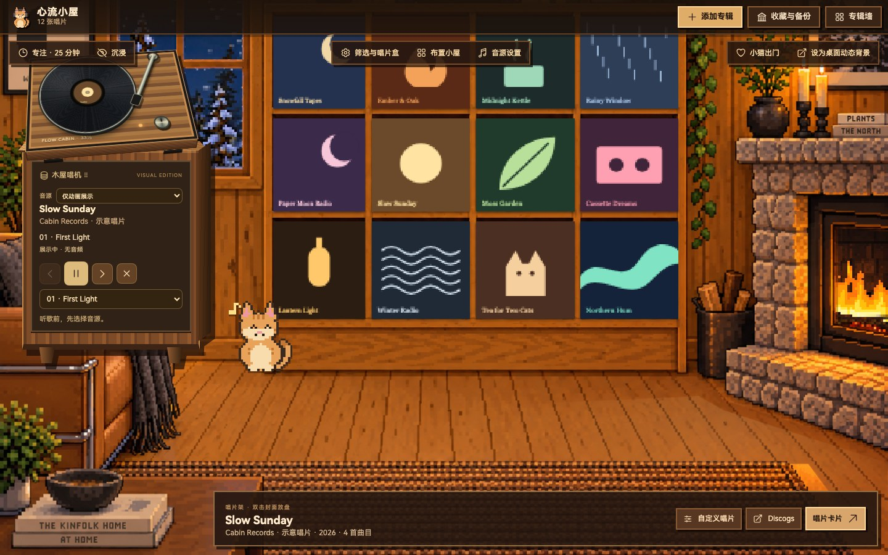
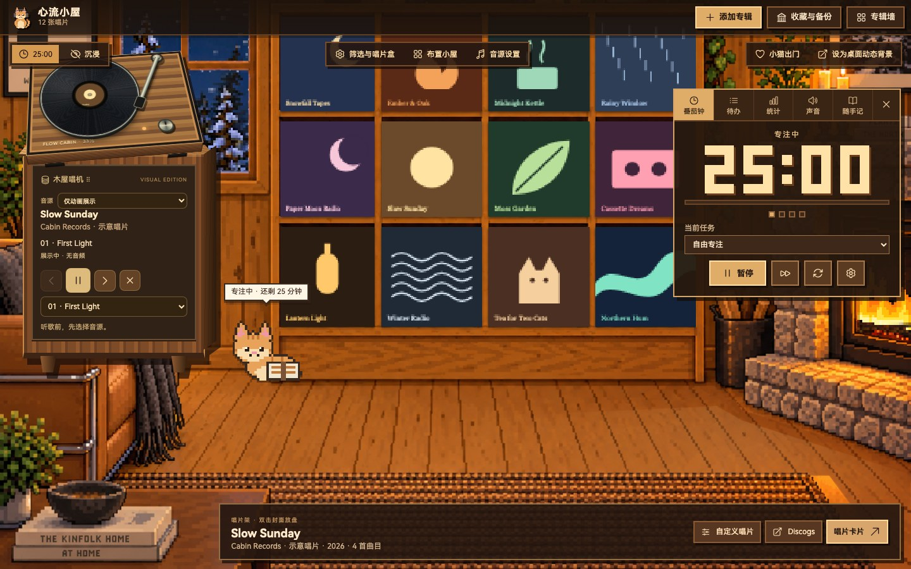
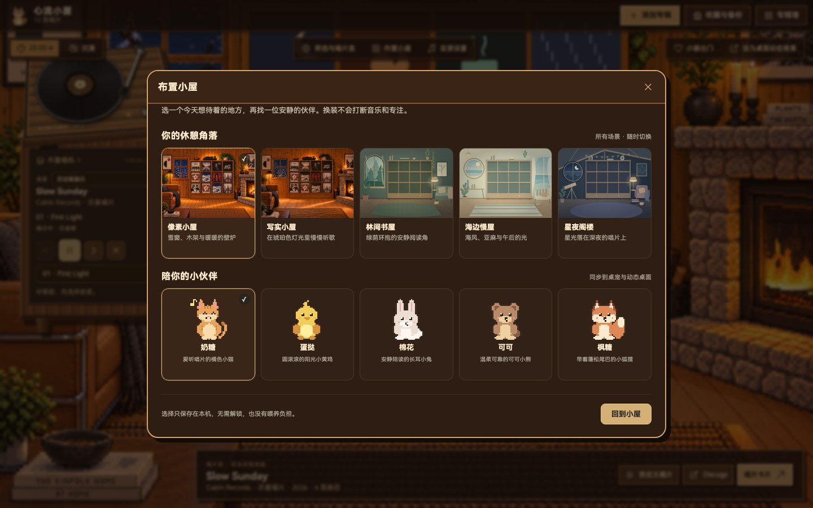

<div align="center">


# 心流小屋 · Flow Cabin

**听一张喜欢的唱片，安心做完这一轮。**

一间有唱片架、专注计时和像素伙伴的小屋。macOS / Windows 桌面应用，收藏与专注数据留在本机。

[**下载最新版 ↓**](https://github.com/ooooooomygosh/album-web/releases/latest) · [第一次使用](docs/getting-started.md) · [更新记录](https://github.com/ooooooomygosh/album-web/releases) · [使用边界](docs/limitations.md)



<sub>本分支实际界面截图，使用原创示意唱片与隔离数据；没有连接平台账号，也不代表真实平台播放验收。</sub>

</div>

## 下载，挑一个适合你的版本

| 你的电脑 | 下载 | 怎么打开 |
| --- | --- | --- |
| Mac · Apple Silicon（M 系列） | [DMG · arm64](https://github.com/ooooooomygosh/album-web/releases/download/v1.8.0/FlowCabin-1.8.0-mac-arm64.dmg) | 打开 DMG，把小屋拖进「应用程序」 |
| Mac · Intel | [DMG · x64](https://github.com/ooooooomygosh/album-web/releases/download/v1.8.0/FlowCabin-1.8.0-mac-x64.dmg) | 打开 DMG，把小屋拖进「应用程序」 |
| Windows · x64 | [安装版](https://github.com/ooooooomygosh/album-web/releases/download/v1.8.0/FlowCabin-1.8.0-x64-setup.exe) · [便携版](https://github.com/ooooooomygosh/album-web/releases/download/v1.8.0/FlowCabin-1.8.0-x64-portable.exe) | 安装版按提示安装；便携版直接运行 |

以上文件名对应 **v1.8.0**；新版本请从 [Release 页面](https://github.com/ooooooomygosh/album-web/releases/latest)选择。macOS 当前未完成开发者签名与公证，Windows 也可能显示未知发布者提示。先核对下载来源，再看[安装说明](docs/getting-started.md#安装与首次打开)。不需要为收藏、专注或环境音注册小屋账号。

> 四种发行产物（Mac arm64 / x64、Windows x64 安装 / 便携）已完成打包与客户端检查；各平台功能的真实设备验收范围不同。已知依赖告警、许可与平台限制见[使用边界](docs/limitations.md)。

## 听一张喜欢的唱片

把专辑放上十二格唱片架，双击封面或拖到唱机上。打开唱片卡片看曲目、写笔记，给黑胶挑一个颜色，再用唱片盒慢慢整理收藏；也可以把喜欢的专辑导出成一张专辑墙。

唱机默认是**仅动画展示，没有音频**。选择本地音乐、QQ、网易云、系统正在播放或 Music Assistant 后，才会走对应音源的播放路径。搜索到专辑不等于获得播放权限。[如何连接音源 →](docs/getting-started.md#连接音乐)

## 安心做完这一轮

点左上角「专注」，选择待办或自由专注。番茄钟、待办、随手记、统计与声音都在同一处；收起面板，让房间陪你。按 <kbd>Z</kbd> 进入沉浸模式，按 <kbd>Esc</kbd> 回来。

雨声、壁炉、风声、白噪声与黑胶底噪由程序合成，Lo-fi 电台也可离线生成。可以分别调音量；唱机播放时，电台会自动降低音量。



<sub>隔离演示中手动开始的专注计时；没有伪造专注历史或完成奖励。</sub>

## 让伙伴陪你待一会儿

在「布置小屋」里，选像素小屋、写实小屋、林间书屋、海边慢屋或星夜阁楼；再找奶糖、蛋挞、棉花、可可或枫糖作伴。点一下伙伴，它会回应你；场景与伙伴随时可以换，不会打断音乐和计时。

伙伴还可以出门成为桌宠，小屋可以成为动态桌面。选择会同步到这两个窗口；支持减少动态效果。三套新增 SVG 场景与五位像素伙伴由本项目代码绘制。



## 连接你常用的音乐

| 音源 | 现在可以做什么 | 需要知道 |
| --- | --- | --- |
| 本地音乐 | 选择文件夹，按标签整理专辑，播放原位置的文件 | 文件保留在原目录；本地播放不需要平台账号 |
| QQ 音乐 / 网易云 | 独立登录窗口、曲目检索与播放接入 | 受账号、会员、版权与地区限制；QQ 我的歌单导入尚未实现 |
| 系统正在播放 | 显示歌曲，发送暂停／继续／切歌命令 | Windows 使用系统媒体接口；macOS 目前连接 Music / Spotify，可能需自动化权限 |
| Music Assistant | 连接已有服务器与播放器 | 需要自己的服务器；未完成真实音箱验收 |

QQ 已在 Mac Apple Silicon 上验证两首真实歌曲的播放、暂停／继续与下一首；不能外推到全曲库。网易云真实账号、Music / Spotify 实际控制及 Windows 对应功能仍需验收。官方 MusicKit / Spotify 内嵌 SDK、通用插件市场均未实现。[完整支持与验收范围 →](docs/limitations.md#音乐与平台)

## 你的收藏，留在你这里

收藏、笔记、黑胶外观、唱片盒、专注记录、待办和随手记保存在本机。「收藏与备份」可导出备份，换电脑时再导入；更新前也建议先备份。平台凭据通过 Electron safeStorage 保存，不能安全加密时拒绝持久保存。

曲库搜索、封面加载和平台播放会访问对应第三方，本地保存不表示所有功能离线。桌宠与动态桌面只接收清洗后的显示数据。[数据、隐私与备份 →](docs/getting-started.md#数据与备份)

## 第一次使用

1. **先选一个地方。** 打开「布置小屋」，选择场景与伙伴；不需要解锁。
2. **听歌，或先专注。** 添加第一张专辑并选择音源；也可以直接点「先专注一会儿」，无需先收藏。
3. **让小屋安静下来。** 在专注工具里调整声音，按 <kbd>Z</kbd> 收起界面；需要时用「收藏与备份」保存一份数据。

[安装、连接音乐与常见问题](docs/getting-started.md) · [已知限制与验证状态](docs/limitations.md)

## 一起打磨小屋

需要 **Node.js 24.x**：

```bash
npm ci
npm --prefix desktop ci
npm run desktop:dev       # 构建并启动 Electron 客户端
npm run check             # 完整 Node 测试与前端生产构建
npm run test:browser      # 隔离浏览器回归，需要 Chromium
```

[贡献指南](CONTRIBUTING.md) · [桌面开发与打包](desktop/README.md) · [架构](docs/architecture.md) · [产品计划](docs/product-plan.md)

根项目许可证与所组合 GPL 模块的分发义务仍待明确，请在再分发前阅读[许可说明](docs/limitations.md#许可与依赖)。这不会因为已有 Release 而自动解决。

<details>
<summary>致谢与来源</summary>

产品灵感：[Chill Pulse](https://store.steampowered.com/app/2826180/Chill_Pulse/)、[lofi-engine](https://github.com/meel-hd/lofi-engine)、[next-beats](https://github.com/btahir/next-beats)、[Study Saga](https://github.com/AchilleasMakris/Study-Saga-Releases)。仅作方向参考，不使用这些项目的角色素材。

依赖与接口：[Simple Music](https://github.com/Yyyangshenghao/simple-music)（GPL-3.0-only）、[Music Assistant](https://github.com/music-assistant/server)、[Tone.js](https://tonejs.github.io/)、[music-metadata](https://github.com/Borewit/music-metadata)、[Heroicons](https://heroicons.com/)、HarmonyOS Sans SC。曲库资料来自 iTunes Search、MusicBrainz 与 Cover Art Archive。字体与素材许可见 [public/licenses](public/licenses)，GPL 模块来源见 [SOURCE.txt](desktop/vendor/simple-music/SOURCE.txt)。

</details>
