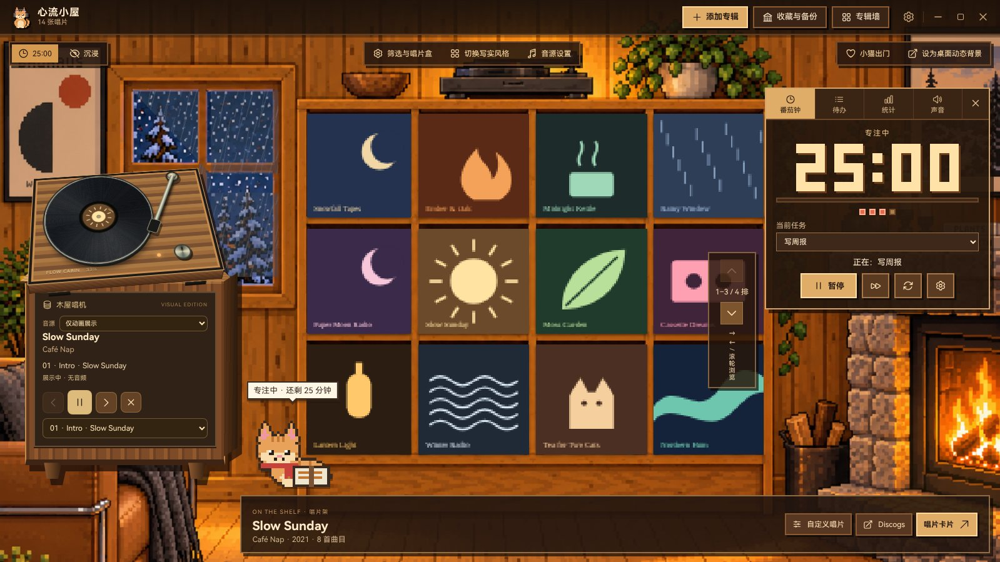
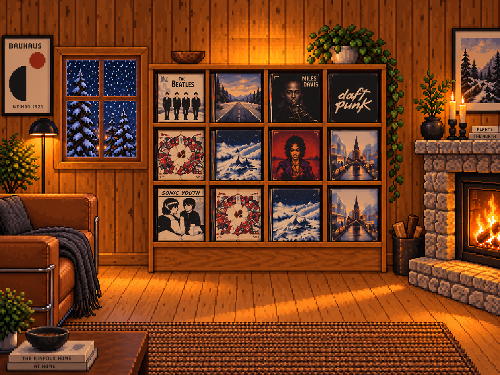
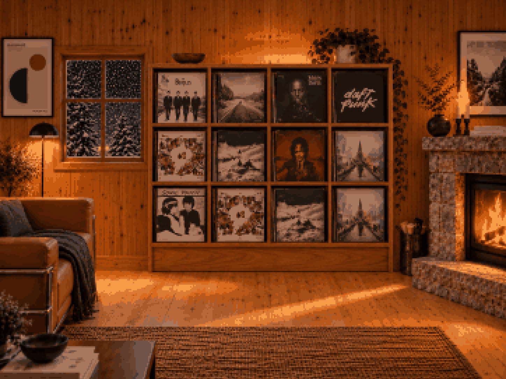
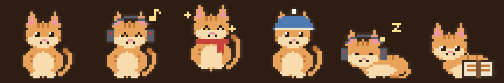
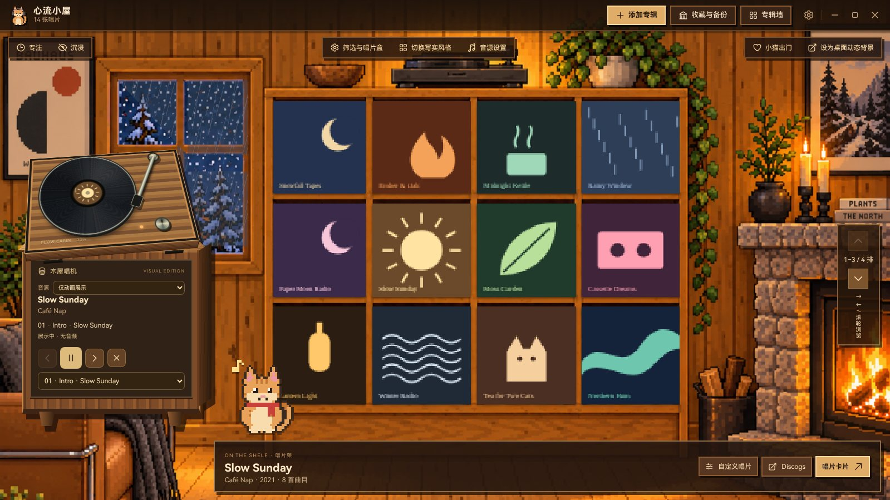
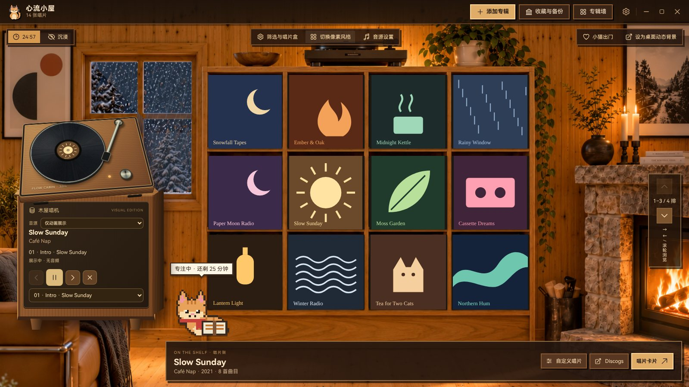
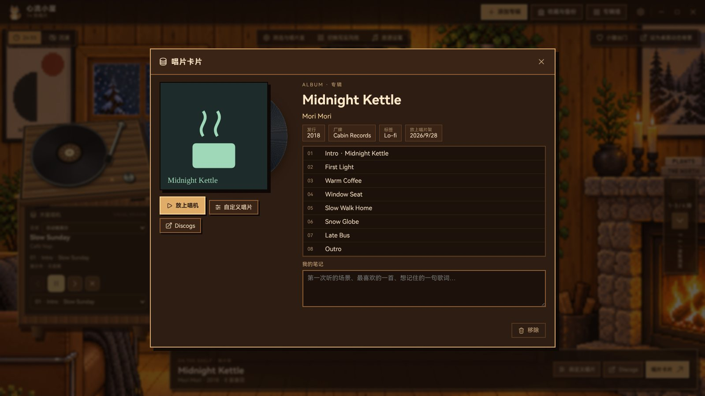
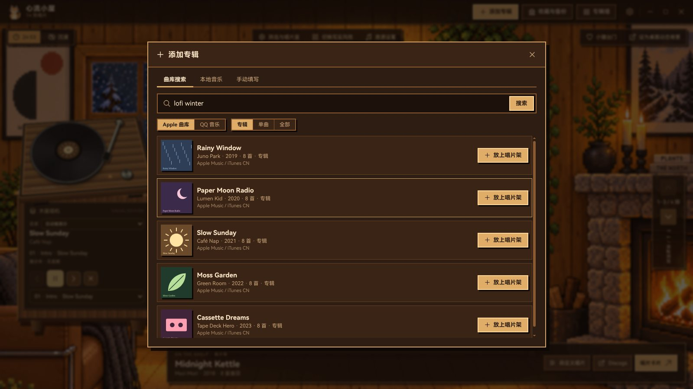
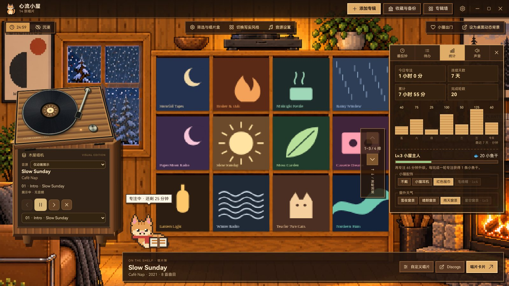
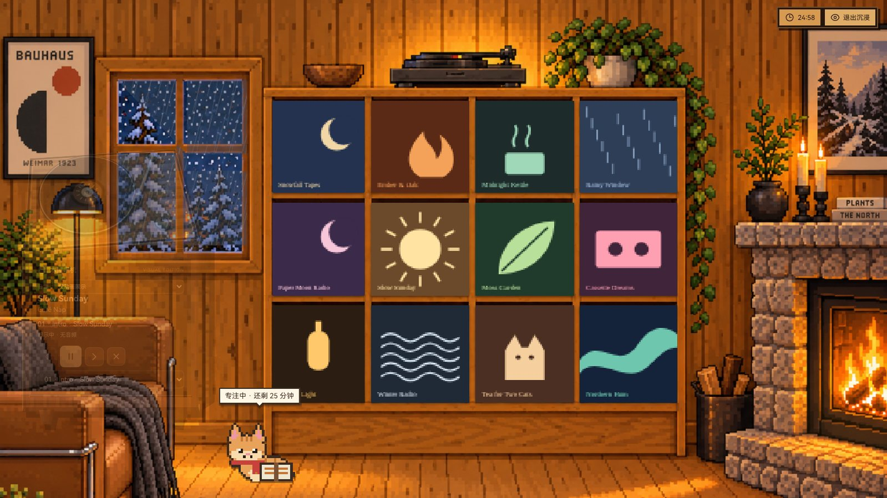

<div align="center">


# 心流小屋 · Flow Cabin

**一间属于你的像素 Lo-fi 小屋：把喜欢的专辑放上唱片架，一边听歌一边专注。**

macOS / Windows 桌面软件 · 所有数据保存在本机，不需要注册

[下载最新版](https://github.com/ooooooomygosh/album-web/releases/latest) · [功能](#功能) · [截图](#截图) · [开发](#开发)



</div>

## 小屋

壁炉噼啪作响，窗外下着雪，唱机上放着你最喜欢的那张专辑。心流小屋把你的收藏放进一间温暖的木屋：十二格唱片架、一台可以真的放歌的唱机，还有一只陪你工作的像素小猫。

<table>
<tr>
<td width="50%"><br><sub><b>像素小屋</b> · 默认风格，封面也会被像素化</sub></td>
<td width="50%"><br><sub><b>写实小屋</b> · 一键切换，同一间屋子的另一种质感</sub></td>
</tr>
</table>

## 功能

**唱片架与唱机**
- 从 Apple 曲库或 QQ 音乐搜索专辑，粘贴 QQ 音乐专辑链接也能精确识别；找不到的也可以手动填写。
- 十二格唱片架，滚轮或方向键翻页；双击封面或把唱片拖到唱机上就能放盘。
- 每张唱片都有一张卡片：曲目、发行信息、你的笔记，点任意一首从那里开始播放。
- 自定义每张黑胶的底色、透明度和最多三色的泼溅；用「唱片盒」给收藏分组，按流派、年代筛选。
- 挑选一批专辑，导出一张专辑墙图片。

**连接你常用的播放器**
| 音源 | 说明 |
| --- | --- |
| 系统正在播放 | Spotify、网易云音乐、QQ 音乐、Apple Music 等正在放的歌会出现在唱机上，可以暂停和切歌（Windows 读取系统媒体控制；macOS 支持 Music 和 Spotify） |
| 本地音乐 | 选择电脑里的音乐文件夹，按标签整理成专辑，音乐留在原位置播放 |
| QQ 音乐 / 网易云 | 在独立窗口登录自己的账号后播放（基于 [Simple Music](https://github.com/Yyyangshenghao/simple-music) 模块，受平台会员与版权限制） |
| Music Assistant | 连接你已有的 [Music Assistant](https://github.com/music-assistant/server) 服务器，在家里的音箱上播放 |

**专注**
- 番茄钟：时长可调，每几轮一次长休息，结束时有提示音和系统通知；关掉窗口躲进托盘也照常计时。
- 待办：拖拽排序，选一项开始专注，记录每项专注了几轮。
- 统计：最近 7 天的专注时长、连续天数和累计时间。
- 奖励：每完成一轮得一条小鱼干，升级后解锁小猫的耳机、围巾、毛线帽，以及雨天、星空等窗景。
- 按 <kbd>Z</kbd> 进入沉浸模式，屋子里只剩唱片、壁炉、小猫和计时。

**声音**
- 雨声、壁炉、风声、白噪声、黑胶底噪，全部由程序实时合成，可以分别调音量，离线也能用。
- Lofi 电台：离线实时生成的 Lo-fi 音乐，每 16 小节换一段；唱机放歌时会自动调低。

**小猫与桌面**
- 小猫会跟着音乐摇头、陪你看书、休息时散步、深夜打瞌睡，点它会回应你。
- 「小猫出门」：小猫跳到桌面上，成为透明、置顶的桌宠，可以随意拖动，右键能开始专注。
- 「设为桌面动态背景」：整间小屋成为桌面壁纸，天气、小猫和计时同步显示。

<p align="center"></p>

## 截图

| | |
| --- | --- |
|  |  |
| 像素小屋：唱机正在转，小猫戴着围巾 | 写实风格 |
|  |  |
| 唱片卡片：曲目、笔记、自定义黑胶 | 添加专辑：曲库搜索 / 本地音乐 / 手动填写 |
|  |  |
| 专注统计与小屋奖励 | 沉浸模式 |

<sub>截图中的专辑封面均为程序生成的示意图。</sub>

## 数据与隐私

- 唱片、笔记、黑胶外观、唱片盒、专注记录和待办都保存在这台电脑，不需要注册任何账号。
- 「收藏与备份」可以导出一个备份文件，换电脑时导入即可；从旧版 Album Circle 升级会自动迁移原来的本地收藏。
- 平台登录信息用系统加密保存在本机，只在播放时使用。桌宠和动态桌面窗口只拿到计时、曲名这类显示数据。

## 开发

```bash
npm ci                       # 前端依赖（React + Vite）
npm --prefix desktop ci      # 桌面端依赖（Electron）
npm run desktop:dev          # 构建并启动客户端
npm run desktop:test         # 单元测试
npm --prefix desktop run dist:mac   # 打包 macOS（Windows 上用 dist:win）
```

推送 `v*` 标签会在 GitHub Actions 上构建 Windows 与 macOS（Apple Silicon / Intel）安装包，跑完检查后发布 Release。界面测试和更多说明见 [desktop/README.md](desktop/README.md)，结构说明见 [docs/architecture.md](docs/architecture.md)。

```text
src/            小屋界面：CabinRoom、唱机、唱片卡片、添加专辑、专注面板、声音、小猫
desktop/        Electron 主进程：本地收藏、曲库搜索、音源服务、桌宠、动态桌面、托盘
public/         字体、小屋原画、图标
docs/           结构说明、路线图、截图
```

## 致谢

- 参考与灵感：[Chill Pulse](https://store.steampowered.com/app/2826180/Chill_Pulse/)、[lofi-engine](https://github.com/meel-hd/lofi-engine)、[next-beats](https://github.com/btahir/next-beats)、[Study Saga](https://github.com/AchilleasMakris/Study-Saga-Releases)。只借鉴思路，代码均为本项目原创。
- 使用：[Simple Music](https://github.com/Yyyangshenghao/simple-music)（GPL-3.0）、[Music Assistant](https://github.com/music-assistant/server) 接口、[Tone.js](https://tonejs.github.io/)、[music-metadata](https://github.com/Borewit/music-metadata)、[Heroicons](https://heroicons.com/)、HarmonyOS Sans SC 字体。详见 [public/licenses](public/licenses)。
- 曲库数据来自 iTunes Search、MusicBrainz 与 Cover Art Archive。
