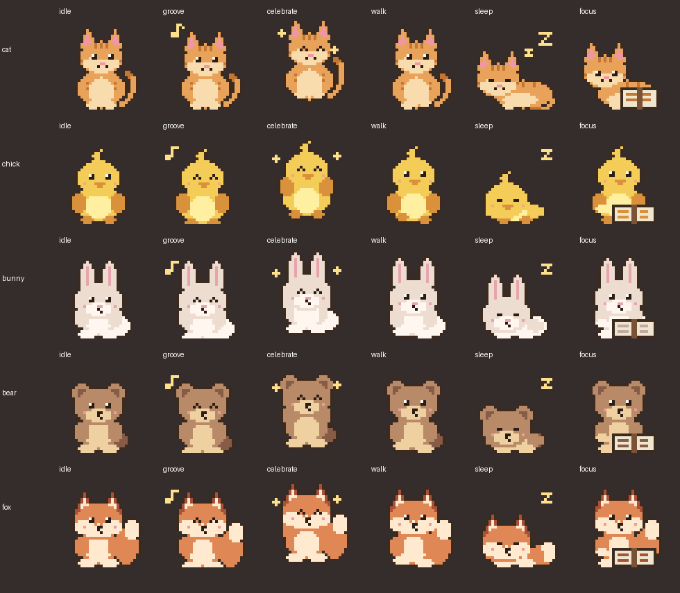
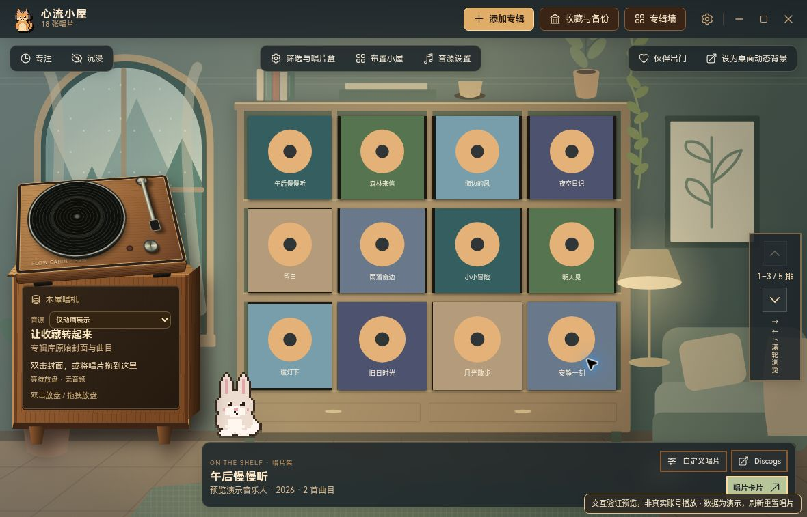
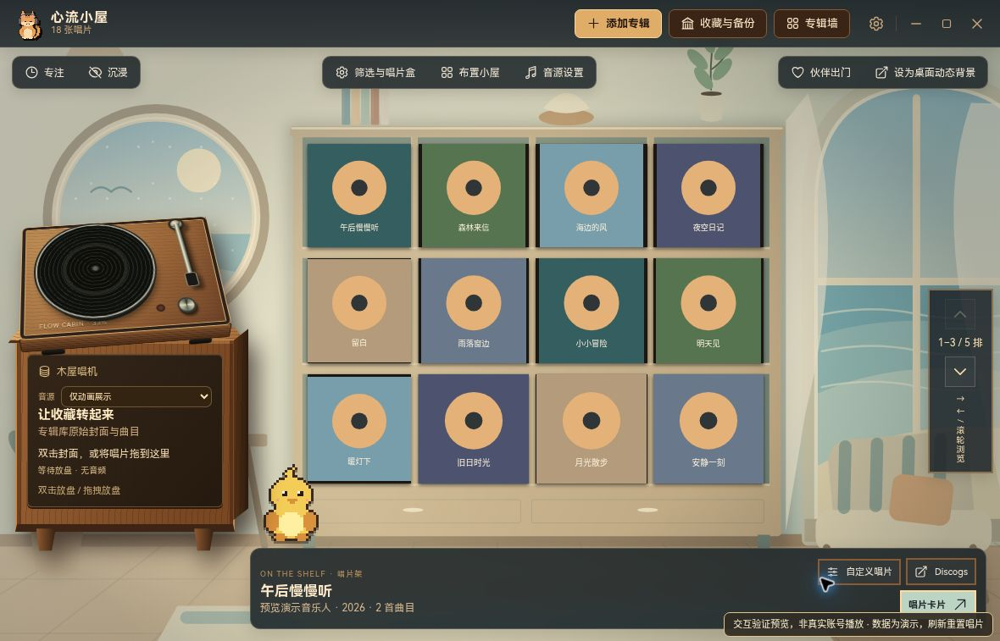
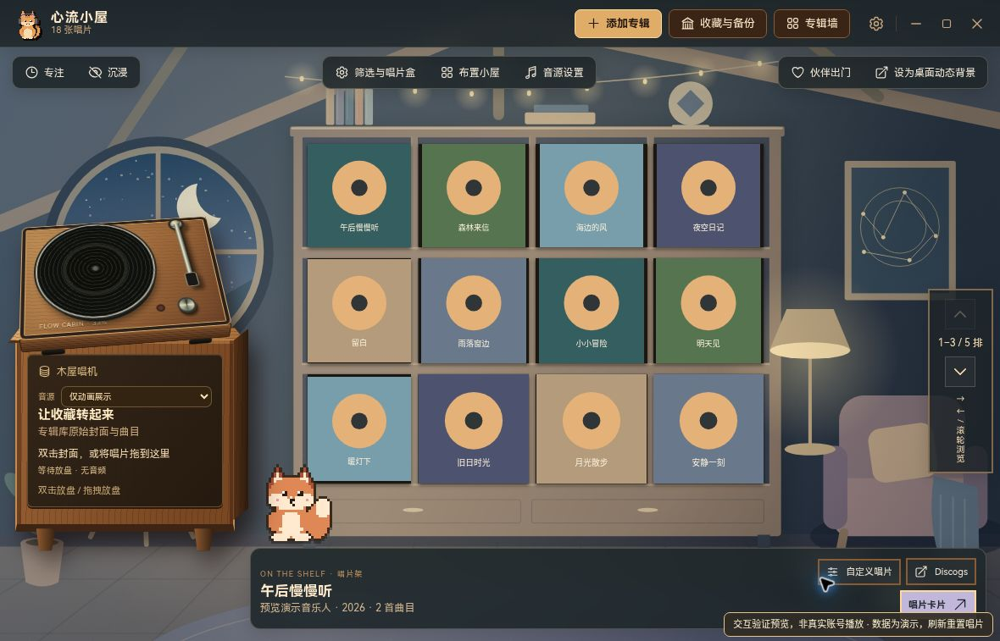
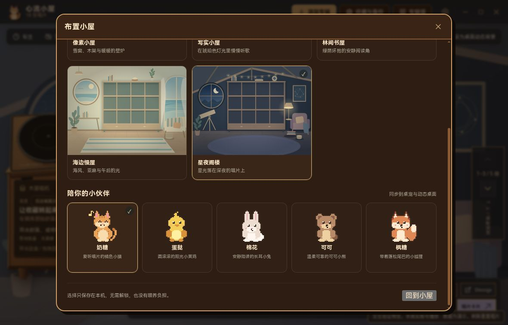

<div align="center">


# 心流小屋 · Flow Cabin

**一间属于你的像素 Lo-fi 小屋：把喜欢的专辑放上唱片架，一边听歌一边专注。**

macOS / Windows 桌面应用 · 收藏与专注数据保存在本机 · 平台音乐服务需另行连接

[下载最新版](https://github.com/ooooooomygosh/album-web/releases/latest) · [功能](#功能) · [截图](#截图) · [开发](#开发)


</div>

> 当前分支是开发版本，不代表最新 Release 已包含本轮变化。代码实现、测试覆盖与真实设备验收请分别查看 [功能矩阵](docs/audit/feature-matrix.md) 和 [验证报告](docs/audit/browser-validation.md)。

## 小屋

壁炉噼啪作响，窗外下着雪，唱机上放着你最喜欢的那张专辑。心流小屋把你的收藏放进一间温暖的木屋：十二格唱片架、一台可以真的放歌的唱机，还有一位陪你工作的像素伙伴。通过「布置小屋」选择场景与伙伴，选择保存在本机。

<table>
<tr>
<td width="50%"><br><sub><b>像素小屋</b> · 默认风格，封面也会被像素化</sub></td>
<td width="50%"><br><sub><b>写实小屋</b> · 一键切换，同一间屋子的另一种质感</sub></td>
</tr>
</table>

新增三个原创代码绘制场景：**林间书屋（forest）**、**海边慢屋（seaside）**、**星夜阁楼（starlight）**，与原有像素（pixel）／写实（warm）小屋共同组成五套场景。新场景是独立 SVG 画面，不是 Steam 游戏素材。

## 功能

**唱片架与唱机**
- 从 Apple 曲库或 QQ 音乐搜索专辑，粘贴 QQ 音乐专辑链接也能精确识别；找不到的也可以手动填写。
- 十二格唱片架，滚轮或方向键翻页；双击封面或把唱片拖到唱机上就能放盘。
- 每张唱片都有一张卡片：曲目、发行信息、你的笔记，点任意一首从那里开始播放。
- 拖动唱机标题可移动唱机，方向键微调，双击标题或按 Home 复位；位置保存在本机。
- 黑胶默认底色取自专辑封面主色；自定义每张黑胶的底色、透明度和最多三色的泼溅；用「唱片盒」给收藏分组，按流派、年代筛选。
- 挑选一批专辑，导出一张专辑墙图片。

**连接你常用的播放器**
| 音源 | 说明 |
| --- | --- |
| 系统正在播放 | Spotify、网易云音乐、QQ 音乐、Apple Music 等正在放的歌会出现在唱机上，可以暂停和切歌（Windows 读取系统媒体控制；macOS 支持 Music 和 Spotify） |
| 本地音乐 | 选择电脑里的音乐文件夹，按标签整理成专辑，音乐留在原位置播放 |
| QQ 音乐 / 网易云 | 在独立窗口登录自己的账号后播放（基于 [Simple Music](https://github.com/Yyyangshenghao/simple-music) 模块，受平台会员与版权限制） |
| Music Assistant | 连接你已有的 [Music Assistant](https://github.com/music-assistant/server) 服务器，在家里的音箱上播放 |

**专注**
- 番茄钟：时长可调，每几轮一次长休息，结束时有提示音和系统通知；关掉窗口躲进托盘也照常计时。
- 待办：拖拽排序，选一项开始专注或使用自由专注，记录每项专注了几轮。
- 随手记：本地自动保存的纯文本便签，纳入收藏与备份；清空前确认。专注、待办、统计、声音、随手记是内置工具注册表，不是第三方插件市场。
- 统计：最近 7 天的专注时长、连续天数和累计时间。
- 奖励：每完成一轮得一条小鱼干，升级后解锁小猫的耳机、围巾、毛线帽，以及雨天、星空等窗景。
- 按 <kbd>Z</kbd> 进入沉浸模式，屋子里只剩唱片、壁炉、小猫和计时。

**声音**
- 雨声、壁炉、风声、白噪声、黑胶底噪，全部由程序实时合成，可以分别调音量，离线也能用。
- Lofi 电台：离线实时生成的 Lo-fi 音乐，每 16 小节换一段；唱机放歌时会自动调低。

**五位伙伴与桌面**
- 奶糖（cat，小猫）、蛋挞（chick，小黄鸡）、棉花（bunny，小兔）、可可（bear，小熊）、枫糖（fox，小狐狸），各有独立轮廓和动作；原有小猫兼容保留。新伙伴由原创代码绘制，不导入 Steam 角色素材。
- 「布置小屋」统一选择场景和伙伴，并把经校验的选择同步给桌宠与动态桌面。支持减少动态效果。
- 小猫会跟着音乐摇头、陪你看书、休息时散步、深夜打瞌睡，点它会回应你。
- 「小猫出门」：小猫跳到桌面上，成为透明、置顶的桌宠，可以随意拖动，右键能开始专注。
- 「设为桌面动态背景」：整间小屋成为桌面壁纸，天气、小猫和计时同步显示。

<p align="center"></p>

<sub>角色图由本项目实际像素渲染数据生成；动作与配件另有确定性测试。</sub>

## 本轮交互预览

以下截图来自本轮真实浏览器中的隔离验证预览。唱片为模拟数据；不代表真实平台账号播放、系统壁纸或桌宠窗口已经完成原生验收。

| 林间书屋 | 海边慢屋 |
| --- | --- |
|  |  |





## 截图

| | |
| --- | --- |
|  |  |
| 像素小屋：唱机正在转，小猫戴着围巾 | 写实风格 |
|  |  |
| 唱片卡片：曲目、笔记、自定义黑胶 | 添加专辑：曲库搜索 / 本地音乐 / 手动填写 |
|  |  |
| 专注统计与小屋奖励 | 沉浸模式 |

<sub>以上是既有版本截图，不能作为本轮五场景／五伙伴的验收证据；专辑封面为程序生成的示意图。本轮实拍预览见上方独立章节。</sub>

## 数据与隐私

- 唱片、笔记、黑胶外观、唱片盒、专注记录和待办都保存在这台电脑，不需要注册任何账号。
- 「收藏与备份」可以导出一个备份文件，换电脑时导入即可；从旧版 Album Circle 升级会自动迁移原来的本地收藏。
- 平台登录信息通过 Electron safeStorage 保存；加密不可用或 Linux 仅有明文回退时拒绝保存凭证。桌宠和动态桌面窗口只拿到经清洗的显示数据，不接收登录令牌。
- 使用曲库搜索、封面和平台播放时仍会访问对应第三方；“本地保存”不表示所有功能离线。Music Assistant 更换服务器时清除旧凭证，退出登录使进行中的播放请求失效。
- 本地文件读取校验所选目录边界，封面代理逐跳校验重定向；这些是防护实现，不是无漏洞保证。

## 开发

```bash
npm ci                       # 前端依赖（React + Vite）
npm --prefix desktop ci      # 桌面端依赖（Electron）
npm run desktop:dev          # 构建并启动客户端
npm run check                # Node 测试（含音频生命周期）+ 前端生产构建
node --test src/audio/lifecycle.test.mjs  # 可单独运行的 16 项音频回归
npm run test:browser         # 隔离夹具浏览器回归，需安装 Chromium
npm --prefix desktop run dist:mac   # 打包 macOS（Windows 上用 dist:win）
```

仓库配置了 PR 检查，以及由 `v*` 标签触发的 Windows／macOS（Apple Silicon / Intel）发行工作流；存在工作流不等于本轮 CI 已通过。本轮没有发布 Release 或生产部署，已用于验证的 Vercel 预览仅使用隔离模拟数据，不具备桌面权限，也不能连接真实音乐账号。界面测试和更多说明见 [desktop/README.md](desktop/README.md)，结构说明见 [docs/architecture.md](docs/architecture.md)。

```text
src/            小屋界面：CabinRoom、唱机、唱片卡片、添加专辑、专注面板、声音、小猫
desktop/        Electron 主进程：本地收藏、曲库搜索、音源服务、桌宠、动态桌面、托盘
public/         字体、小屋原画、图标
docs/           结构说明、路线图、截图
```

## 验收与发行边界

- 确定性测试验证状态机、快照、安全边界和异常恢复；浏览器与部分 Electron 界面测试使用模拟账号、媒体服务和原生桥。
- 云浏览器已完成场景／伙伴、收藏增删与笔记、重载和紧凑布局检查；[当前 V6 合并功能夹具预览](https://album-circle-69p2yqms2-homings-projects-d78a7226.vercel.app/) 自测于 2026-10-08 17:36–17:37 UTC 在 960×600 下通过 31/31 断言，捕获错误列表为空，含真实生成 WAV 播放、PNG 导出、实际一分钟专注、延迟封面早保存及模拟壁纸错误／取消／重试；另已人工验证唱机拖动与重载同时保留位置、场景和伙伴。[原始自测结果](docs/audit/browser-self-test-v6-result.json)与[拖动重载记录](docs/audit/browser-turntable-v6-result.json)。
- 独立 Playwright 套件仍因本机 Chromium 启动限制未运行成功。最终伙伴动画已通过可见开关复验：正常模式的 10 次截图出现 4 个不同帧，减少动态模式的 10 次截图保持同一帧；这不是原生桌宠窗口的性能或系统集成验收。[详细证据与边界](docs/audit/browser-validation.md)。
- [macOS Apple Silicon 原生验收](docs/audit/native-mac-acceptance-2026-10-09.md)已验证五场景／伙伴同步、选择恢复、动态背景启停／取消／故障恢复、两个屏幕分别启动、真实一分钟专注，以及修复后的 QQ 两首歌曲播放进度、暂停／继续／下一首。桌宠真实拖动／透明透传未完成；Spaces、Music／Spotify 控制、整曲自然结束、会员／地区覆盖、安装包、Intel 与 Windows 仍未验收。QQ 我的歌单导入和旧收藏 mediaMid 自动补全未实现。
- 桌面依赖仍有未解决的上游安全公告；根目录项目许可证及所组合 GPL 模块的发行义务仍需明确。不要把本分支称为安全审计通过、许可已合规或可直接正式发行。
- 后续范围与放行条件见 [产品计划](docs/product-plan.md)；音乐接入与许可风险见 [产品审查](docs/audit/2026-10-product-review.md)。

## 致谢

- 参考与灵感：[Chill Pulse](https://store.steampowered.com/app/2826180/Chill_Pulse/)、[lofi-engine](https://github.com/meel-hd/lofi-engine)、[next-beats](https://github.com/btahir/next-beats)、[Study Saga](https://github.com/AchilleasMakris/Study-Saga-Releases)。作为产品方向参考；本轮新增伙伴与 SVG 场景为原创代码绘制，第三方依赖另列如下。
- 使用：[Simple Music](https://github.com/Yyyangshenghao/simple-music)（GPL-3.0）、[Music Assistant](https://github.com/music-assistant/server) 接口、[Tone.js](https://tonejs.github.io/)、[music-metadata](https://github.com/Borewit/music-metadata)、[Heroicons](https://heroicons.com/)、HarmonyOS Sans SC 字体。详见 [public/licenses](public/licenses)。
- 曲库数据来自 iTunes Search、MusicBrainz 与 Cover Art Archive。
