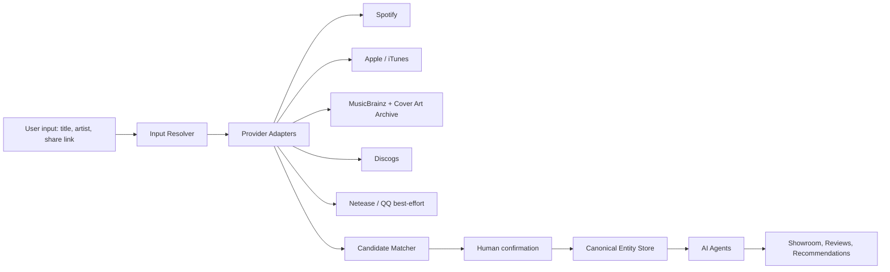

# Album Circle Architecture

## Current App

- `src/main.jsx`: React single-page app with account, room, showroom, add music, review, AI recommendation, and room management flows.
- `src/styles.css`: responsive Liquid Glass-inspired interface with glass intensity control, reduced motion control, candidate cards, comments, AI panel, and mobile breakpoints.
- `api/auth.js`: server-issued account sessions backed by Firestore user documents.
- `api/rooms.js`: room creation, invite joining, member profiles, and room isolation.
- `api/search.js`: `GET /api/search?term=...&type=song|album|all` calls the public iTunes Search API and maps results into the app's unified candidate schema.
- `api/items.js`: Firestore-backed showroom items for songs and albums.
- `api/comments.js`: Firestore-backed room comments with authenticated author attribution.
- `api/ai/background.js` and `api/ai/recommend.js`: DeepSeek/OpenAI-compatible AI completion routes.
- `docs/product-plan.md`: product plan, feature modes, agent plan, API strategy, and next milestones.
- `docs/research-sources.md`: source list for product, API, and open-source references.

## Target Services



## API Contracts

```ts
type Candidate = {
  id: string;
  type: "song" | "album";
  source: string;
  title: string;
  artist: string;
  year?: string;
  label?: string;
  producer?: string;
  cover?: string;
  platforms: string[];
  confidence: number;
  match: number;
  tracks: string[];
  context: string;
  tags: string[];
};

type SourceRef = {
  provider: "spotify" | "apple" | "itunes" | "musicbrainz" | "cover-art-archive" | "discogs" | "lastfm" | "netease" | "qq";
  providerId: string;
  url?: string;
  fetchedAt: string;
  attributionRequired: boolean;
  cachePolicy: "ephemeral" | "short" | "long" | "user-confirmed";
};
```

## Implementation Milestones

1. Add provider adapters behind a shared `search()` / `lookup()` interface for Spotify, Apple Music, MusicBrainz, Discogs, Last.fm, Netease, and QQ Music.
2. Add richer source provenance and version matching fields such as ISRC, UPC, release group, and label credits.
3. Upgrade AI calls to structured JSON for recommendations, comment replies, taste summaries, and background research.
4. Add safe URL resolver with redirect limits, SSRF protections, platform parsers, and short-link handling.
5. Add cover proxying and image cache controls for long-term resilience.
6. Add accessibility states, keyboard shortcuts, and profile pages for long-term rooms.
