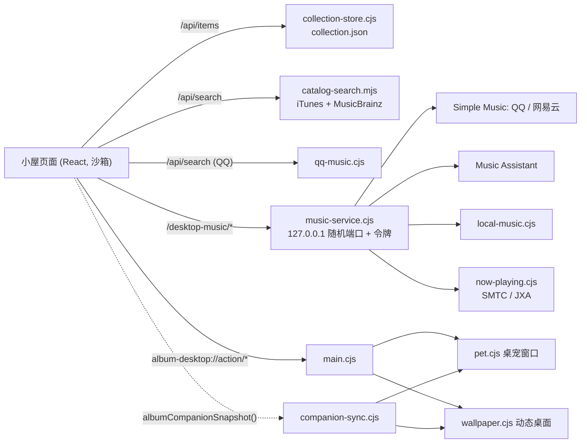

# 心流小屋 · 结构说明

心流小屋是一个 Electron 桌面应用。界面用 React 写成，运行在一个沙箱化的页面里；所有需要系统能力的部分都在主进程中实现。

## 页面与主进程

- 页面固定使用一个虚拟来源 `https://album-circle.vercel.app`，所有请求都由 `desktop/site-router.cjs` 在本机响应，这个地址永远不会真正发起网络请求。来源保持不变，旧版本保存的黑胶样式、唱片盒和专注记录就能继续使用。
- 页面没有 Node 权限。需要原生能力时，它打开一个 `album-desktop://action/...` 地址，主进程只认固定的命令名。
- 桌宠和动态桌面是两个独立的沙箱窗口。它们每 750ms 读取一次只读快照（专注阶段、剩余时间、曲名、天气、配饰），能发回给页面的命令只有一个白名单。

## 数据

| 数据 | 位置 |
| --- | --- |
| 唱片（专辑、曲目、笔记） | 用户数据目录下的 `collection.json`，旧版的 `local/collection.json` 会在首次启动时迁移 |
| 黑胶外观、流派、唱片盒、小屋风格 | 页面 localStorage `album-circle-library-v1-local-owner` |
| 专注、待办、奖励 | localStorage `album-circle-focus-v1:local-owner` |
| 声音混音 | localStorage `album-circle-sound-v1` |
| 平台登录、Music Assistant 令牌 | `music.json`，用 Electron safeStorage 加密 |
| 本地音乐索引 | `local-music.json`，封面缩略图在 `local-music/covers/` |
| 桌宠位置与大小 | `pet.json` |

用户数据目录沿用首个版本的名称 `Album Circle`，升级后数据不会丢失。

## 前端模块

| 位置 | 职责 |
| --- | --- |
| `src/App.jsx` | 标题栏、收藏加载、各弹窗 |
| `src/CabinRoom.jsx`、`RoomScene.jsx`、`RoomTurntable.jsx` | 小屋、唱片架、筛选、唱机、沉浸模式 |
| `src/AddAlbum.jsx`、`RecordCard.jsx`、`BackupDialog.jsx` | 添加专辑、唱片卡片、备份 |
| `src/RecordLibrary.jsx`、`record-library.mjs` | 黑胶外观、唱片盒、流派 |
| `src/focus/` | 番茄钟状态机（纯函数）、待办、统计、奖励 |
| `src/audio/` | 合成环境音、Tone.js Lo-fi 生成器 |
| `src/pet/` | 像素小猫精灵、行为模型、桌宠页面 |
| `src/AlbumWall.jsx` | 专辑墙图片导出 |

## 测试

- `npm --prefix desktop test`：单元测试，覆盖番茄钟、统计、小猫、Lo-fi 生成、收藏存储与迁移、路由、本地音乐、系统正在播放、快照清洗、音源服务等。
- `desktop/test/*-ui.cjs`：用 Playwright 驱动 Electron 的界面测试，测试数据放在内存中。在 Linux 上需要用 `xvfb-run` 运行。
- `desktop/test/client-ui.cjs`：对打包后的客户端做冒烟测试，GitHub Actions 会在 Windows 和 macOS 上运行。
