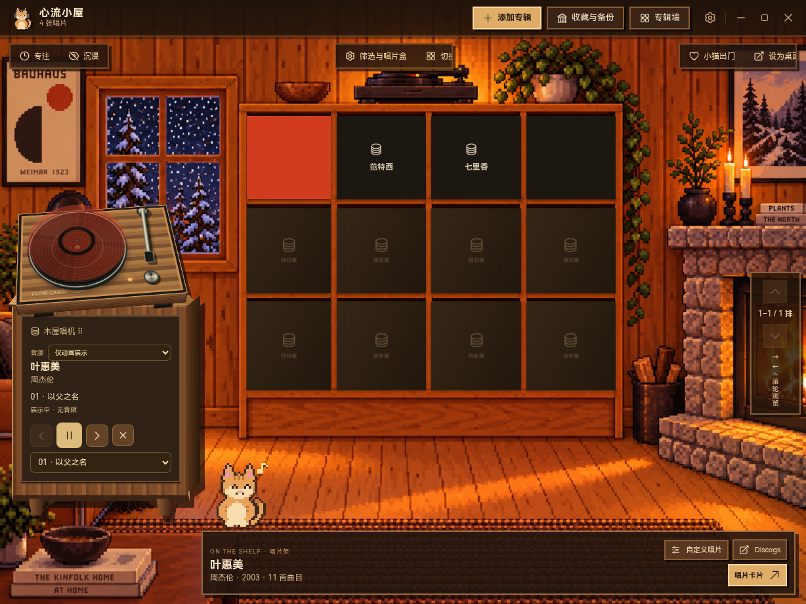
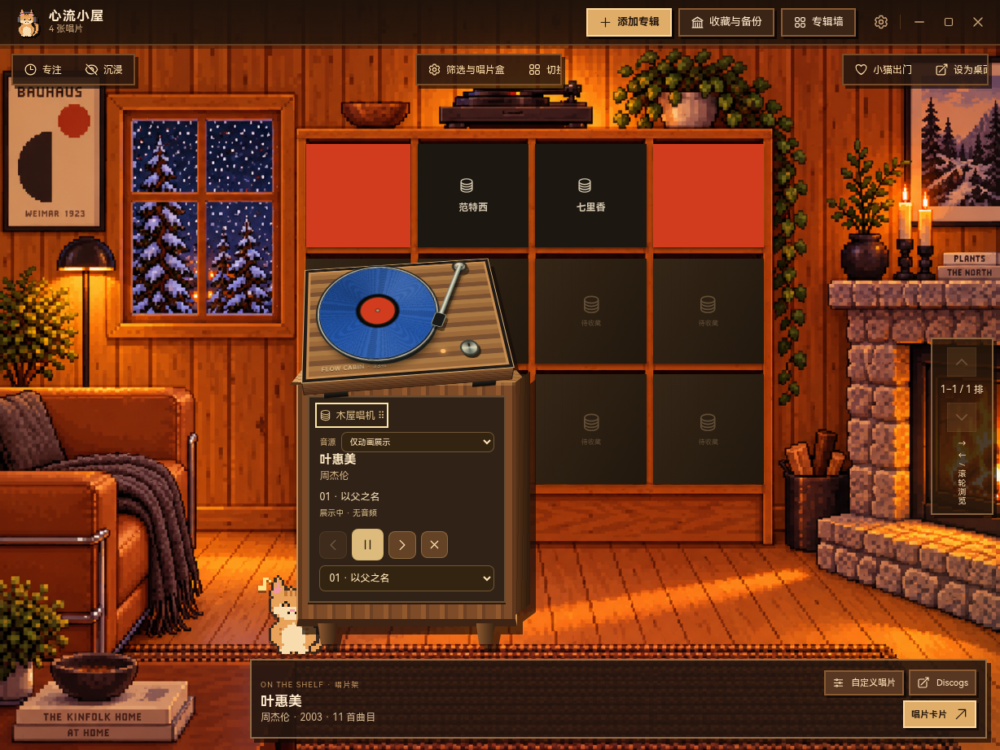
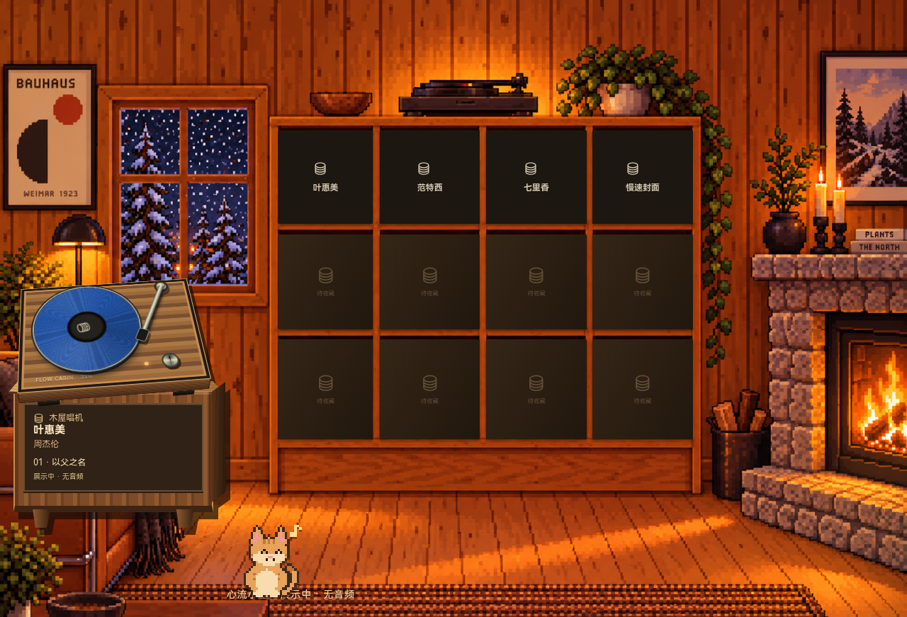

# 动态背景、唱机移动与封面取色验证

基于远端 main `db029819dacc6c12588041b07cd72f71656a6bd5`，在 Linux 云端、Node 24.19.0 / npm 11.9.0 / Electron 44.6.0 上验证。

## 行为与证据

- 动态背景错误提示显示 5 秒后消退，也可手动关闭。应用中可以取消；沿用 `wallpaper-start` / `wallpaper-stop` 与原有只读快照接口。
- 动态背景在创建窗口前注册独立 session 的协议并检查入口资源。资源读取异常返回 404，不再让异常逃出协议处理函数。启动有 20 秒截止时间；取消时中断资源请求和正在启动的 Windows helper；关闭/崩溃时销毁窗口并清理计时器，过期异步结果不能影响后续启动。
- 主页面唱机标题是拖动手柄，支持鼠标、触控、方向键移动，双击或 Home 复位。相对位置保存在现有 room 设置中，窗口改变尺寸时重新约束位置。播放按钮、曲目选择、双击放盘与专辑拖放保留。
- 默认黑胶底色来自封面采样中数量最多的颜色分组，用于拖拽预览、唱片卡片、唱机和已有壁纸快照。复用 `/desktop-image`，无新增外部 API、服务器或 Electron bridge 接口。封面不存在、读取失败或跨域不可读时回退原默认黑胶色。保存的手动底色和取色等待期间明确选择的底色优先；只编辑透明度、泼溅或泼溅配色时仍跟随主色，且不丢失其他编辑。“恢复默认黑胶”重新启用自动主色。

**根因边界：** 已确认旧代码的提示常驻、缺少启动截止时间/崩溃清理和异步竞态；资源 I/O 异常也会从原协议处理函数直接抛出。最新 main 的完整构建在 Linux 上可以加载 `album-desktop://wallpaper/wallpaper.html`，尚不能断定用户原生平台截图中的 `ERR_FAILED (-2)` 究竟由哪项环境条件触发。这里没有把 Linux 资源加载成功当成 Windows/macOS 桌面挂载通过。

## 已运行

| 检查 | 结果 |
| --- | --- |
| `npm run build` | 通过 |
| `npm --prefix desktop run build:web` | 通过，包含 wallpaper/pet HTML 与资源 |
| `npm run desktop:test` | 62 项通过 |
| `DISPLAY=:99 npm --prefix desktop run test:cover-editor` | 4 组延迟封面编辑检查通过，含透明度、泼溅、手选底色和恢复默认 |
| `DISPLAY=:99 npm --prefix desktop run test:improvements` | 9 组检查通过，无页面异常 |
| `DISPLAY=:99 npm --prefix desktop run test:library` | 5 组检查通过，含真实重启保存的颜色 |
| `DISPLAY=:99 npm --prefix desktop run test:shelf` | 9 组检查通过，含 1024/1920/3840 布局 |
| `DISPLAY=:99 npm --prefix desktop run test:pet` | 6 组检查通过 |
| `git diff --check` | 通过 |

新增单元测试覆盖错误、缺失资源、重复启动、取消/关闭、超时、崩溃、旧加载/位置调整/同步结果与新启动之间的隔离，以及 Windows attach 的取消（native 为 mock）。真实 Electron 用 Xorg dummy 运行，验证独立壁纸 session、HTML/资源、只读 renderer、实际 Linux 不支持提示及重试；没有伪装成 Windows 成功。兼容既有测试路径的 `electron.exe -> electron` 软链接仅存在于被忽略的 `node_modules`，不属于提交或环境快照修复。

新增 UI 测试还验证真实触控拖动/取消、键盘移动/复位、960×600 至 3840×2160 的位置约束、页面重载后位置保留、封面主色、手动色优先、延迟取色不覆盖正在编辑的颜色，以及缺失/损坏封面的回退。

## 截图

测试使用生成的纯色封面；截图不代表真实用户收藏。

默认色来自红色封面：

移动唱机后，用户手选的蓝色保留：

Linux 独立壁纸 renderer 的资源加载冒烟（没有原生桌面挂载）：

## 原生验收待办

- Windows 安装版/便携版：从小屋应用动态桌面，确认位于图标后、点击穿透正常；取消、失败后重试、关闭主窗口、停止壁纸、显示器变化无残留窗口。
- macOS：桌面层显示、Space 切换和鼠标穿透，关闭/重试行为。
- 在原报错机器上确认原始 `ERR_FAILED` 是否仍出现；若有，保留 `wallpaper-start-failed` 日志中的实际错误与安装包版本继续定位。

仓库当前唯一工作流只接受 `v*` 标签或 `workflow_dispatch`，普通分支/PR 不会启动该发布流程。本任务不创建标签、不触发发布、不部署、不合并。
