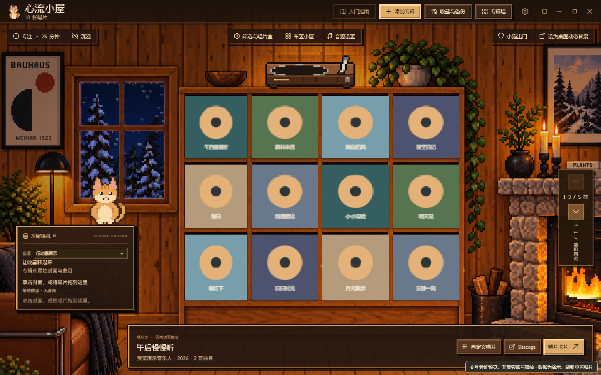
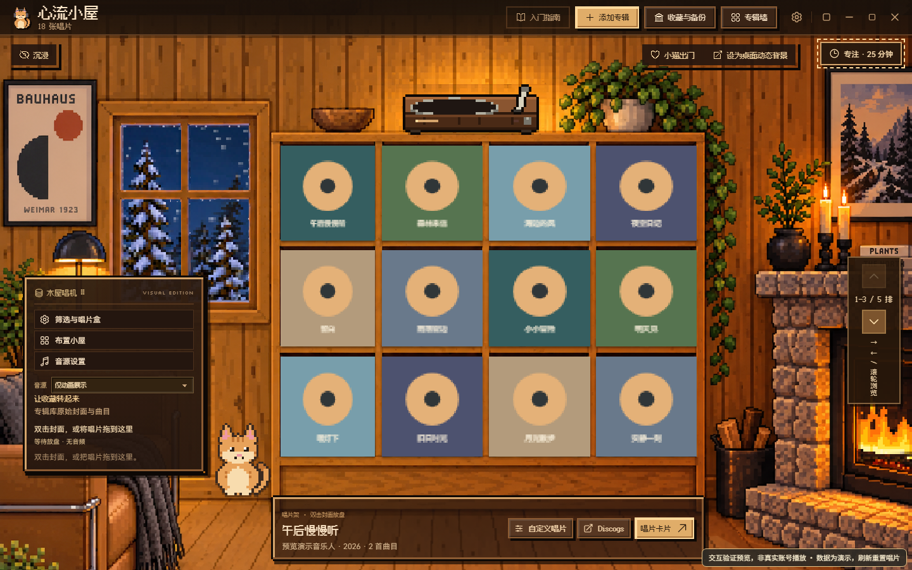
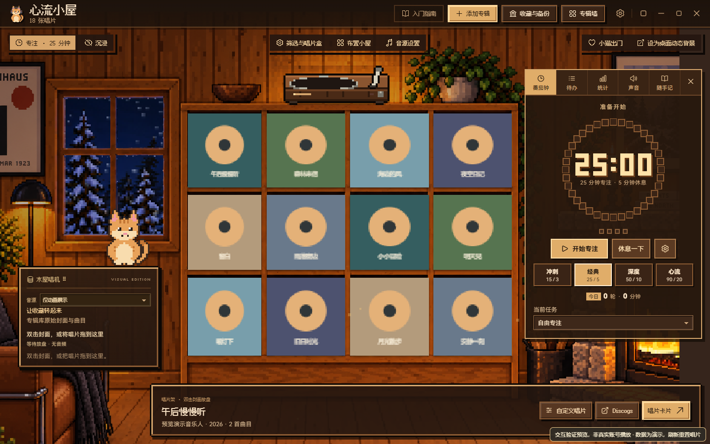
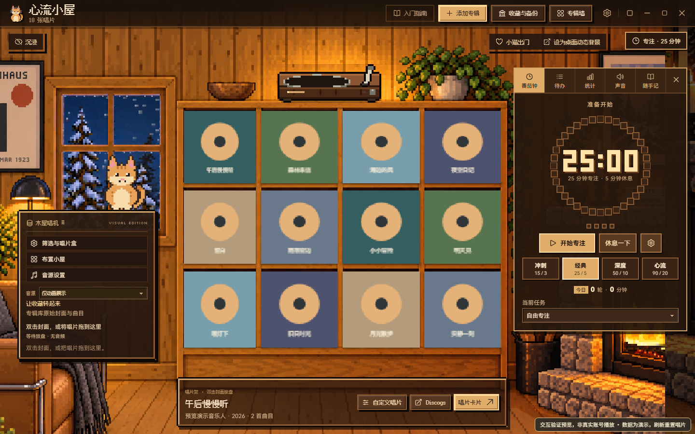
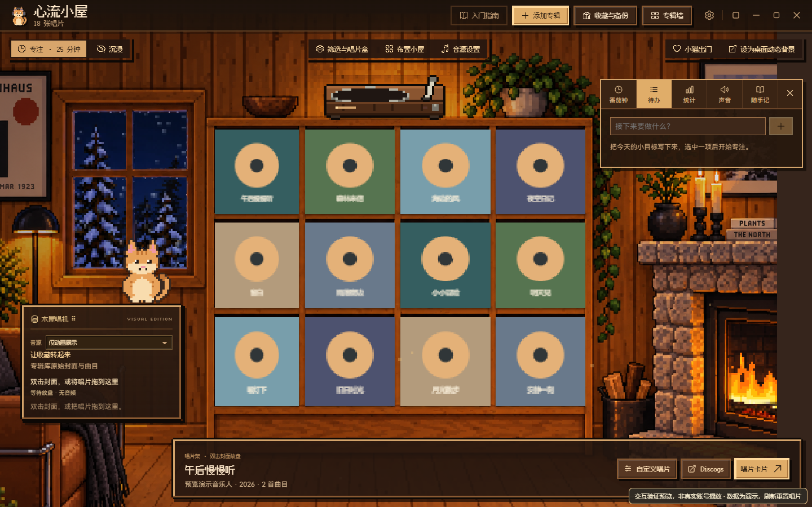
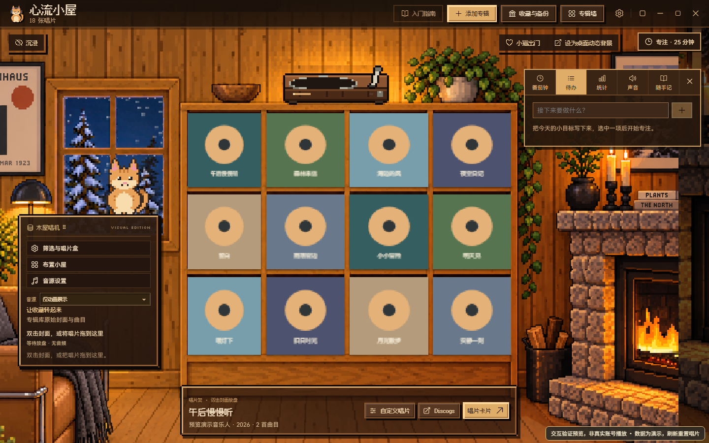
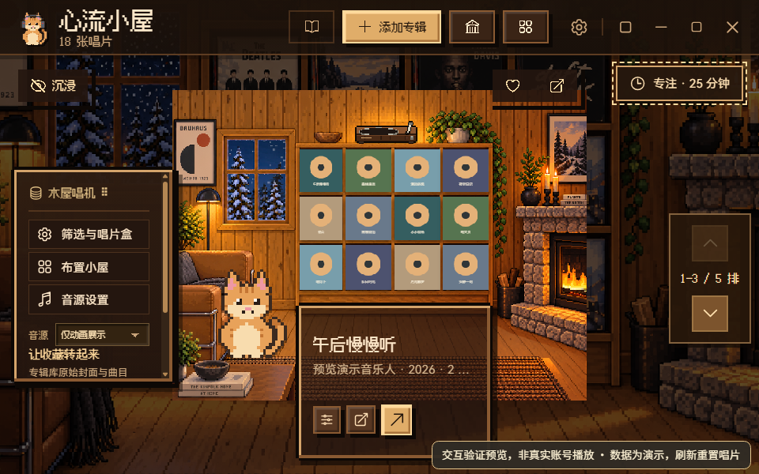
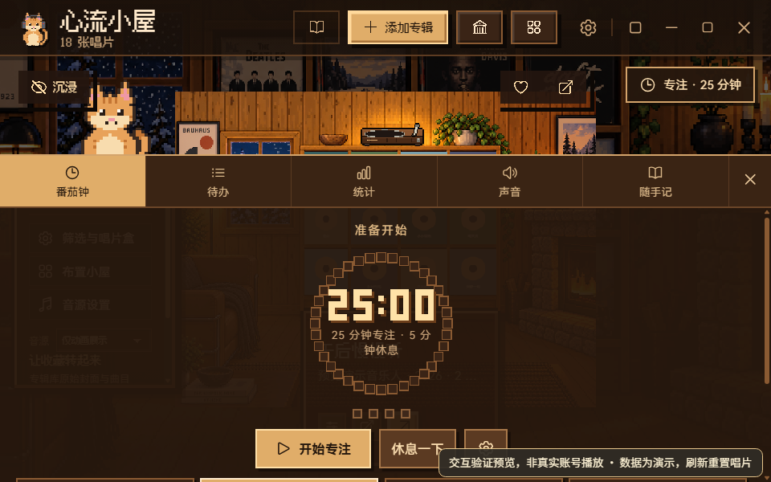
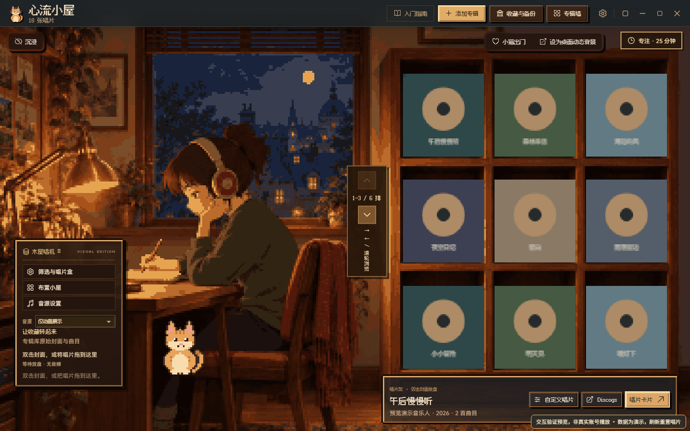

# 小屋布局：参考图修复与验证

基线为最新 `main`：`89a02b017d1f15fa082b793dc07f1bba6ae0ca60`。三张用户参考图已实际查看；这里的截图均来自隔离的演示收藏，不含用户账号、收藏或私有素材。

## 图1 / 图2：信息卡与左侧工具

信息卡以前从唱机右侧一直延伸到窗口右边。现在用同一场景坐标计算唱片架外框和信息卡的左右边界，位于架子下方。月夜书桌使用自己的外框坐标。卡片背景的 alpha 为 `0.7`，标题、元数据和按钮的累计 opacity 为 `1`；窄卡片使用有完整 accessible name / title 的图标按钮。固定的响应式卡片高度避免「变窄 → 换行变高 → 场景继续缩小」的反馈循环，包括出现第四个待播按钮时。

筛选与唱片盒、布置小屋、音源设置移到木屋唱机标题下，处于拖动手柄之外。原事件与状态保留：筛选展开、已筛选数量、高亮、布置和音源对话框。筛选面板增加收起按钮，避免紧凑窗口中面板遮住原入口后无法关闭。

| 修改前，1440×900 / 100% | 修改后，同尺寸 |
| --- | --- |
|  |  |

## 图3：根因与已确认方案

`RoomScene` 原来把右侧专注面板的左边界变成整个场景的 `safeArea.right`。158px 高的待办面板和约547px 高的计时面板因此都保留一整条右侧禁区。场景缩小后，本应填充边缘的背景伪元素又继承了旧的 `display:none`，导致面板下面露出大块纯色。

经用户确认，采用常驻小计时徽章、按需展开面板的方案。宽屏按实际面板矩形检查唱片架和架顶唱机的交集，在面板左 / 右 / 上 / 下的可行区域中选择最大的场景比例，再优先减少相机移动；没有交集则保持原几何。关闭面板后恢复原布局。背景层重新显示，用现有场景的暗色延伸填充边缘。

面板仍按内容高度展开、内部滚动；待办不固定成计时器高度。900 CSS px 以下使用可收起的底部浮层，按需暂时覆盖房间，避免永久挤小唱片架。计时继续运行，徽章保留状态；关闭按钮、徽章与 Escape 均可收起，Escape 将焦点还给徽章。这是响应式浮层的取舍，展开期间要操作被覆盖的房间内容时先收起面板。

| 修改前 | 修改后 |
| --- | --- |
|  |  |
|  |  |

## 回归与截图

- `npm run check`：桌面测试158通过 / 1跳过，渲染层与几何测试34通过，生产构建通过。
- `npm run test:browser`：45项通过；覆盖工具操作、待播第四个按钮、全部六个场景、五个常用窗口尺寸、专注开关，以及沉浸模式左侧唱机隐藏 / 显示；无页面或控制台错误、意外外部请求。
- `npm run test:layout`：16组真实 Electron 内容尺寸与 `webContents.setZoomFactor` 组合通过，每组切换五个专注标签，共80次；检查开关 / Escape、窗口内边界、宽屏面板与唱片交集、信息卡对齐、背景 alpha、文字 opacity、按钮溢出及横向页面溢出。另检查月夜书桌和沉浸模式。详情见 [原始几何报告](electron-layout-report.json)。

| 窗口内容尺寸（原生像素） | 缩放 |
| --- | --- |
| 960×600、1440×900、1920×1080、2560×1440 | 75%、100%、125%、150% |

缩放截图通过 `webContents.capturePage()` 采集完整窗口，避免 Playwright 的离屏视口截图在非100%时裁切。

| 紧凑窗口960×600 / 125% | 同窗口按需展开底部面板 |
| --- | --- |
|  |  |

复现：安装根目录与 `desktop` 依赖后运行上述命令。`test:layout` 使用桌面依赖中的 Electron，也可通过 `ELECTRON_EXECUTABLE` 指定已有 Electron；`LAYOUT_OUTPUT` 可指定证据目录。测试窗口 `show:false`、`offscreen:true`，使用临时独立 profile 和离线 fixture，不调用真实桌面输入或账户服务。

## 与其他工作重叠及范围

检查时 PR [#12](https://github.com/ooooooomygosh/album-web/pull/12) 仍为独立草稿，head 为 `350793362bace7c08f0f8dc2c3c4f2a07e5b5265`，base 同为本基线。其桌面模式、歌单、唱机特写涉及 `CabinRoom`、`RoomScene`、`RoomTurntable`、`room-console.css`，测试脚本和 `package.json` 也重叠。两份草稿并行，未来若合并需协调这些位置；本次没有合并或采纳该 PR。

本次仅验证布局与渲染行为、既有回归。尚未验证安装包、真实账号、物理声音输出或原生壁纸 / 桌宠附着。本次不发布安装包、不部署、不改变音乐 API 或收藏数据格式。
